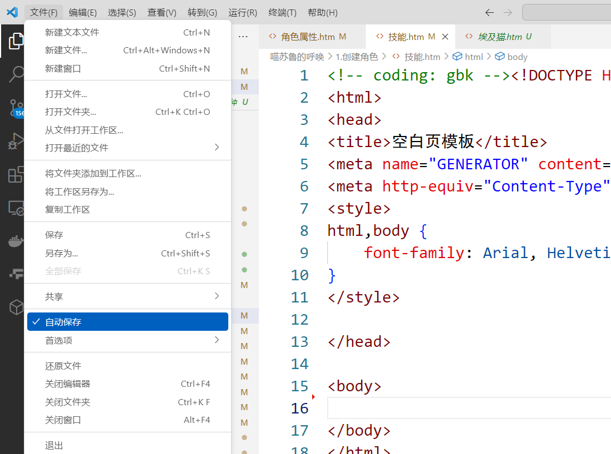
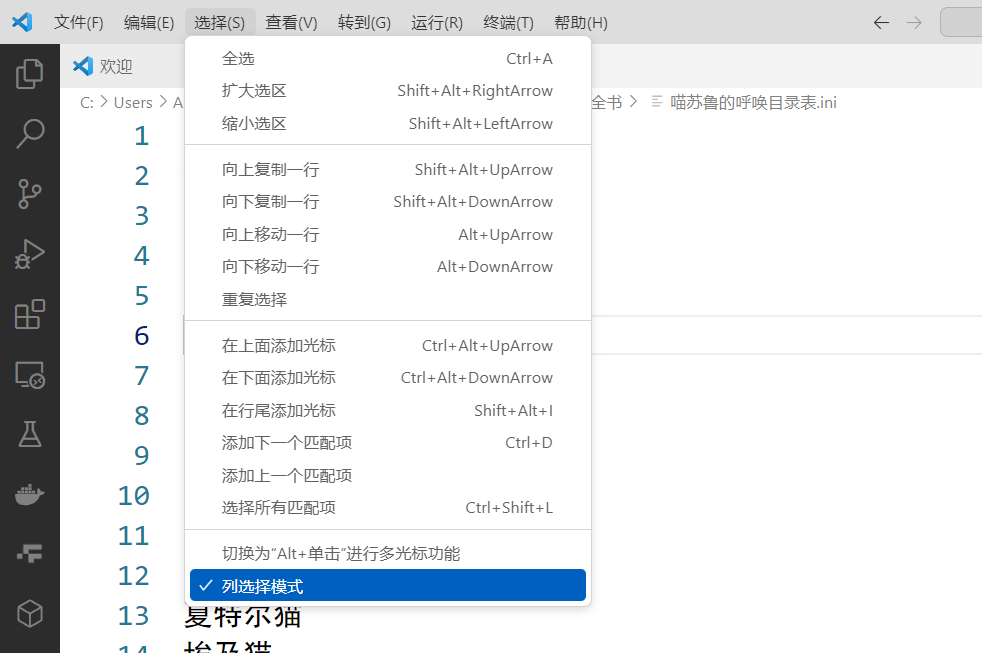
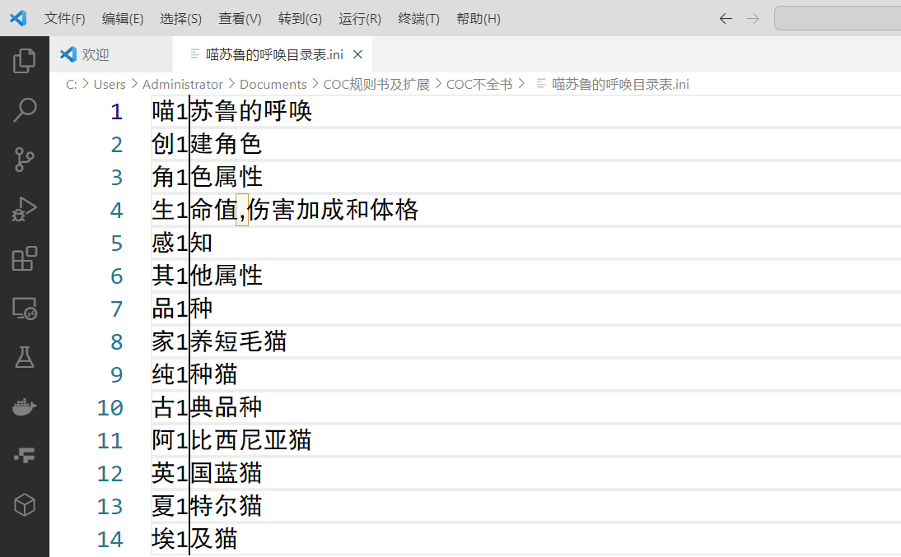
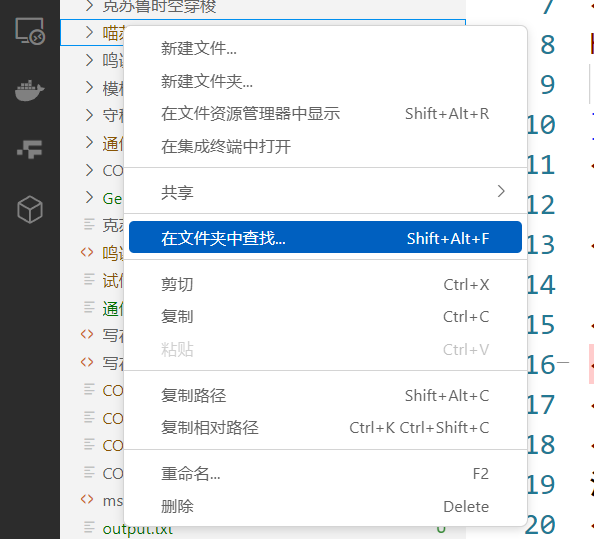
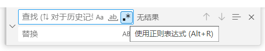
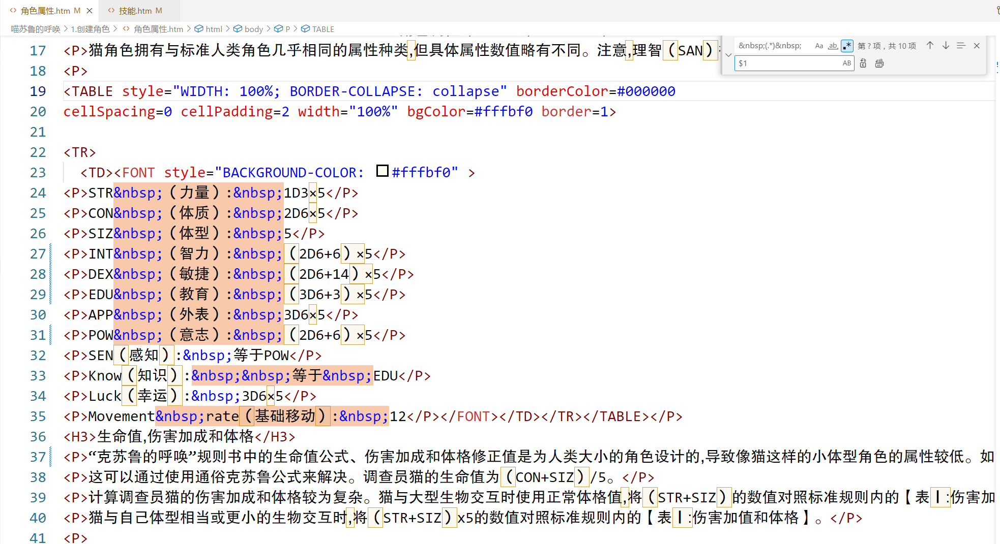

---
lang: zh-cn
title: VScode 使用技巧
---

# VScode 使用技巧

本节教大家一些 VScode 的使用技巧，来帮助大家快速上手。

::: tip 基础快捷指令

这里提供一些 VScode 上最基础的一些快捷指令，重点字符是最重要的几个快捷指令，如果指令都记不好的话，推荐不要顽强自己，尝试用编程的办法来编辑不全书。

（通用）：表示除了 VScode 之外，在别的编辑器也同样生效，如 word、Winchm

- **撤销（通用）：`Ctrl`+ Z**
- **恢复：`Ctrl`+ Y**
- **剪切（通用）：`Ctrl`+ Z**
- **复制（通用）：`Ctrl`+ C**
- **粘贴（通用）：`Ctrl`+ V**
- **查找（通用）：`Ctrl`+ F**
- **替换（通用）：`Ctrl`+ H**
- **多选（VGcode、文件资源管理器可用）：长按`Ctrl`+ 鼠标点击**
- 选中全部匹配项：`Ctrl`+ F2（不打开替换弹窗时也可生效）/`Alt`+`Enter`（打开替换弹窗内才可生效）
- 下一个匹配项：`F3`
- 上一个匹配项：`Shift`+ `F3`
- 全选（通用）：`Ctrl`+ A
- 选中全行（通用）：选中结尾 +`Shift`+ `Home`/选中开头 +`Shift`+ `End`
- 打开/关闭右侧工具栏：`Ctrl`+ B
- 保存（通用）：`Ctrl`+ S
- 另存为（通用）：`Ctrl`+`Shift`+ S
- 关闭当前文件（通用）：`Ctrl`+ W
- 关闭所有文件：`Ctrl`+ K +`W`
- 转到该行开头：`Home`
- 转到该行结尾：`End`

:::

## 一 VScode 打开文件夹

VScode 可以打开全部的文件夹。

这样的话可以在左侧资源管理器一栏里直接点击打开、编辑文件与文件夹，不用到文件资源管理器上编辑了。

当你已经克隆仓库时，可通过 Github Desktop，让库在 VScode 里编辑。

## 二 自动保存

大家编辑文件时，有时会遇到还没来得及保存时，程序奔溃关闭，而之前的心血全部白费的情况。因此一些程序考虑到这件事，推出了自动保存功能，vscode 就自带这种功能。

鼠标移到上方工具栏中文件一项，可以看到弹窗里有自动保存一项，自动保存旁边打钩的话就说明已经开启了。

## 三 列选择模式

有时我们只想编辑一行中的开头或者结尾或者中间，然而在一般情况下鼠标选中一列向下拖动的话会选中中间的全部文字，如果不想选中中间的文字的话，推荐开启列选择模式。

鼠标移到上方工具栏中选中一项，可以看到弹窗里有列选择模式一项，列选择模式旁边打钩的话就说明已经开启了。

然后可以看到跟下图一样，在一行中往下拖动鼠标不会选中全行，只会选中相应的位置。通过列选中模式我们可以快捷的编辑同一列文字。

在列选择模式下按住`Ctrl`键再向下拖动鼠标，可以正常的选中中间的文字。如果嫌弃麻烦的话，关闭列选择模式也是可以的。

## 四 自动换行

Vscode 默认情况下，一行代码就占一行，这种情况下一行代码可以拖得很长的情况常常发生。

我们可以打开自动换行功能，这样可以方便我们查看文本，点击上方的工具栏里的查看，然后点击自动换行，自动换行旁边打钩的话就说明自动换行功能已经开启了。

在自动换行形式下编辑的话，建议关掉列选择模式。

## 五 选中全部匹配项

Vscode 上可以在不打开替换弹窗的情况下直接编辑全部的匹配项。

首选用鼠标选中你要编辑的文字，然后按住`Ctrl`+ F2，就可以看到全部匹配项都被选中了。

然后点击`→`即可从匹配项末尾开始编辑，点击`←`即可在匹配性开头开始编辑。

## 六 在文件夹内查找替换

VScode 相比其他编辑器先进的一点是，他可以查找一个文件夹内全部的匹配项*，并且替换文件夹内全部的匹配项。

首先在左侧的资源管理器里，右键点击你要修改的文件夹，然后选中在文件夹中查找。

然后左侧资源管理器就会变成搜索栏，搜索栏的各项属性如下图所示，在文件列表点击文件即可查看替换前与替换后的对比。

::: warning 注意

VScode 可以查找多行文件，你可以复制多行文本在查找搜索栏与替换搜索栏中，你也可以在搜索栏中用`Ctrl`+`Enter`来手动换行。

:::

要注意的是，在多个文件内的替换不能撤销，所以替换多个文件前，务必查看替换结果保证能获得你想要的结果，替换前建议先利用 git 上传文件至云端，如果到时候替换结果不如意时，点击左侧分叉按钮，在源代码管理界面中按照下图所示放弃所有更改就好了。

## 七 正则匹配

之所以推荐利用编程源代码来编辑不全书，是因为文本编辑器有正则匹配功能，正则匹配配合 VScode 的在文件内查找的能力，能轻松的实现一些功能，如检查中英文排盘，批量更改句子格式等。

::: tip 什么是正则匹配

正则表达式(Regular Expression)是一种文本模式，包括普通字符（例如，a 到 z 之间的字母）和特殊字符（称为"元字符"），可以用来描述和匹配字符串的特定模式。正则表达式(regular expression)描述了一种字符串匹配的模式（pattern），可以用来检查一个串是否含有某种子串、将匹配的子串替换或者从某个串中取出符合某个条件的子串等，可以极大的提高处理字符串的效率。

:::

在 VScode 里，搜索时在搜索栏中点击`。*`按钮，即可开启正则表达式。

如图所示，利用正则表达式，可以快速选中既定格式的文本。

如下图，`.*`代表所有任意字符串，`(.*)`代表在匹配 &amp;nbsp; 中间的全部字符串（包含 &amp;nbsp;）。

其中 () 起到定义`.*`这个元素的作用，替换才用得到，在查询中并无实际意义。

之后可以按照自己要求，对相应的匹配项进行相应的更改。

如下图，$1 代表着查找项中第一个 () 内的元素，也就是查找项中 .* 的内容。如下图所示，单个 $1 的替换结果就是，保留 &amp;nbsp; 中间的全部字符。

之后的教程离，很多步骤会用到正则匹配，到时候会告诉你需要使用的查找项或者匹配项。

当然你也可以参考下方的链接参照如何使用正则匹配：  
[https://blog.vlinyu.com/archives/regular-expression-vscode](https://blog.vlinyu.com/archives/regular-expression-vscode "https://blog.vlinyu.com/archives/regular-expression-vscode")

此外要注意的是，word 的正则匹配自成一系，不如 VScode 的正则匹配要方便，不要搞混。
