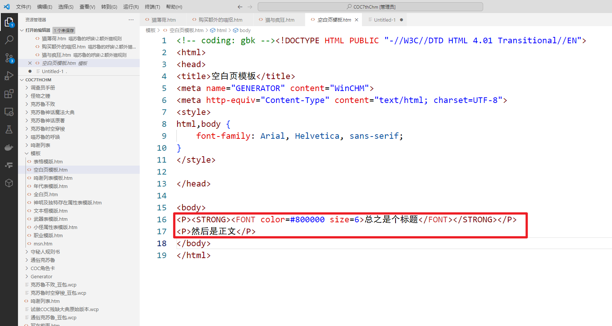
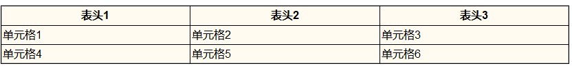
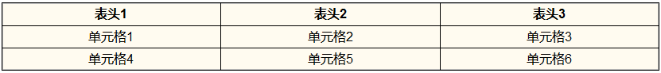
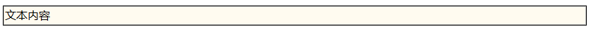
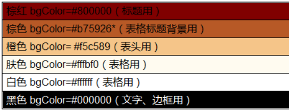

---
lang: zh-cn
title: 最最基础且会用得的 html 知识
---
<!-- markdownlint-disable-file MD001 -->

# 最最基础且用得到的 html 知识

打开用 VScode 打开空白页模版，可以看到一下内容，其他不用管，我们只用编辑`<boby></body>`之间红框内的内容，其他地方除非你最好不要动。



html 语言绝大部分都是`<标签>内容</标签>`这种格式，其中内容记录这段显示的文本，而标签记录着文本的属性。`<标签>`为开始标签，`</标签>`为结束标签，而`<标签>内容</标签>`，被称为 html 元素。

## 最基础的标签

下面书签代表文章里最基础的两个属性：标题与段落，以下元素可以独立出现在文本里，且不建议混用于同一段文字里：

```html
<P>默认的一段字段</P>
<H1>标题一</H1>
<H2>标题二</H2>
<H3>标题三</H3>
<H4>标题四</H4>
<LI>一个列表项</LI>
```

效果同下：


::: tip

正确例：

`<H3>标题</H3>`

`<P>内容`

错误例：

`<H3><P>标题</H3>`

`<P>内容<P>`

:::

## 属性标签

下面书签是给文字附加元素的，元素不能单独使用，必须配合上面的基础标签

```html
<!--加粗文本-->
<B>加粗文本</B>
<STRONG>加粗文本</STRONG>

<!--斜体文本-->
<I>倾斜文本</I>
<EM>倾斜文本</EM>

<!--上下标-->
<sub>下标</sub>
<sup>上标</sup>
```

效果如下：

**加粗文本**  
*倾斜文本*  
<sub>下标</sub>  
<sup>上标</sup>

::: tip

正确例：

`<P><B>加粗文本</B></P>`  
`<P><sub>下标文本</sub></P>`

错误例：

`<B>加粗文本</B>`  
`<sub>下标文本</sub>`

:::

使用例子：

```html
<P>祝各位<B>天天大成功</B>！远离<I>大失败</I>，且<B><I>团永不被咕</I></B><sup>什么可能</sup>，少遇刁民！</P>
```

显示效果：

祝各位<B>天天大成功</B>！远离<I>大失败</I>，且<B><I>团永不被咕</I></B><sup>什么可能</sup>，少遇刁民！

如上图所示，开始标签与结束标签成对出现，否则会出现不好的后果。

比如如果前面的加粗文本标签没配合结束标签的话。

会导致`<B>`**标签后的全部都被一起加粗了，前面的其他标签也是如此，因此必须在文本加粗结束的地方，加上`</B>`标签。并且前面出现了多少个没结束的加粗标签就要加多少个**`</B>`标签，因为一个`</B>`标签只能结束一个加粗标签。

## HTML 空元素

上面的 HTML 元素都直接作用于文字，必须开始标签与结束标签同时出现，否则会带来不好的后果，不过也有一些标签不直接作用于文字上，且就发生在那一处地方，那么它就不用结束。不全书用到的空元素如下：  
折行  
`<BR>`

水平线`<HR>`

***

::: warning 注意：

`<BR>`一般插在`<P>内容</P>`中间，`<BR>`折行效果跟`<P>`分段效果不一样。

这是分段：

内容

这是折行：  
内容

此外注意不要出现`<P><BR>`这种情况，如果`<P><BR>`连在一起，会导致中间空两行的情况发生。

:::

## 图片

HTML 图像是通过标签``来定义的：

```html

```


其中 src 后面引号内的是图片对于当前文件所处文件夹的相对位置，如果你不懂可以先[在 wcp 里面添加图片](./Winchm/otherstr.md) ，慢慢实验就明白了。

## 链接

chm 文件里有两种链接，分别是导向别的项目的链接与导向网址的链接（href 后面括号里填相对文件路径，如果不知道相对文件路径就直接在 wcp 搞超链接）。

导向别的项目的链接：

```html
<!--导向别的项目的链接-->
<A href="相对文件路径" title="超链接 title">超链接显示名</A>
```

导向网址的链接：

```html
<!--导向网址的链接-->
<A href="网址" title="超链接 title">超链接显示名</A>
```

## 段落

```html
<!--无序列表-->
<UL>
<LI>列表项</LI>
<LI>列表项</LI>
<LI>列表项</LI></UL>

<!--有序列表-->
<OL>
<LI>第一个列表项</LI>
<LI>第二个列表项</LI>
<LI>第三个列表项</LI></OL>
```

效果同下：

### 无序列表

- 列表项
- 列表项
- 列表项

### 有序列表

1. 第一个列表项
2. 第二个列表项
3. 第三个列表项

## 表格

编程很大一个优点就是，编辑表格时更加轻松自由，且能实现更多功能。

表格的最基础标签如下：

```html
<P>
<TABLE>
<TR>
<TH>表头 1</TH>
<TH>表头 2</TH>
<TH>表头 3</TH></TR>
<TR>
<TD>单元格 1</TD>
<TD>单元格 2</TD>
<TD>单元格 3</TD></TH>
<TR>
<TD>单元格 4</TD>
<TD>单元格 5</TD>
<TD>单元格 6</TD></TABLE>
```

其中`<TABLE>表格</TABLE>`代表这块是一个表格，`<TR>一行</TR>`代表表格的一行，而`<TD>单元格</TD>`代表表格中的一格，而`<TH>表</TH>`相当于文本加粗且文本默认位于正中央的单元格。

不过单单一个`<TABLE>`是不够实现我们需求的表格，因此我们一般会在`<TABLE>`里加上别的属性，来实现更多样的表格，以下是常用的`<TABLE>`属性：

### 黑框，单元格默认背景为#fffbf0（肤色）

```html
<P>
<TABLE style="WIDTH: 100%; BORDER-COLLAPSE: collapse" borderColor=#000000 cellSpacing=0 cellPadding=2 width="100%" bgColor=#fffbf0 border=1>
```

#### 呈现效果



### 黑框，单元格默认背景为#fffbf0（肤色），文字居中

```html
<P>
<TABLE style="BORDER-COLLAPSE: collapse; text-align: center" borderColor=#000000 cellSpacing=0 cellPadding=2 width="100%" bgColor=#fffbf0 border=1>
```

#### 呈现效果



### 文本框

```html
<P>
<TABLE style="WIDTH: 100%; BORDER-COLLAPSE: collapse" borderColor=#000000 cellSpacing=0 cellPadding=2 width="100%" bgColor=#fffbf0 border=1>  
<TR><TD>文本内容</TD></TR></TABLE></P>
```

#### 呈现效果



### 属性表用到的

```html
<TABLE style="WIDTH: 100%; BORDER-COLLAPSE: collapse;text-align: center" borderColor=#000000 cellSpacing=0 cellPadding=2 width="100%" bgColor=#ffffff border=1>
```

#### 呈现效果


## 在书签里添加别的属性

刚刚在表格一栏中，我们会往`<TABLE>`里添加别的属性以来满足我们的需求，其实出了空元素标签，我们别的标签都可以往里面添加别的属性。

添加别的属性的标签如图所示`<标签 别的属性>内容</标签>`，你也可以往一个标签里新增多个属性，只要属性直接用空格隔开就可以了，下面介绍一些常用的属性：

::: tip 属性列表

`size= （数字）`：字体大小。

`text-align`: ：表示文字对齐位置，text-align: center 为居中，text-align: left 为居左，text-align: right 为居右。

`width=（数字）`：宽度，一般作用于图片和表格，单位默认为像素，如果数字后面加了`"数字%"`则变为占页面的百分比。

`height=（数字）`：高度，一般作用于图片跟表格，单位默认为像素。

`Color=（颜色值）`：颜色数据，等号后面输入颜色值，整个不全书用到的颜色如下：

`bgColor=（颜色值）`：背景颜色。

`borderColor=（颜色值）`：边框颜色。

`border=（数字）`：边框，单位默认是像素。

`colspan="（数字）"`：跨几格，用于表格。例如`<TD colspan=  "2">`就是该单元格跨两格。

`rowspan="（数字）"`跨几列，用于表格。例如`<TD rowspan="2">`就是该单元格跨两列。

:::

以上就是编辑不全书时需要掌握的属性，html 还有其他属性，但并不需要你掌握。



为了方便其中一段文字导入属性，有`<FONT>文字</FONT>`标签，该标签并无实际意义，作用就是方便导入属性，如下图所示：

```html
<P><STRONG><FONT color=#800000 size=6>带属性的文字</FONT></STRONG></P>
```

效果如下：

<P><STRONG><FONT color=#800000 size=6>带属性的文字</FONT></STRONG></P>

## 总结

基本上，了解好以上信息后，你就可以编辑美观且符合规范的不全书了，如果你想实现更丰富的功能，可以去看专业的[html 新手教程](https://www.runoob.com/html/html-tutorial.html "html 新手教程")&nbsp;。

如果你在编程过程中遇到什么不会的，可以参考不全书里其他文件的源代码，也可以随时到不全书群里面询问。

以下再贴几个代码示例：

### 页面标题的格式

<P><STRONG><FONT color=#800000 size=6>这是一个标题</FONT></STRONG></P>

```html
<P><STRONG><FONT color=#800000 size=6>这是一个标题</FONT></STRONG></P>
```

### 一个美观丰富的表格


```html
<P>
	<TABLE style="BORDER-COLLAPSE: collapse; TEXT-ALIGN: center" borderColor=#000000 cellSpacing=0 cellPadding=2 width="100%" bgColor=#fffbf0 border=1>
	<TR bgColor=#f5c589><TD>攻击</TD>
	<TD>伤害</TD>
	<TD>描述</TD></TR>
	<TR><TD>啃咬</TD>
	<TD>1D4</TD>
	<TD>成功擒抱住对手后，猫可以通过一个成功地啃咬咬断猎物的脊椎，从而杀死小型猎物</TD></TR>
	<TR bgColor=#ffffff><TD>撕裂</TD>
	<TD>2D3+DB</TD>
	<TD>成功擒抱住对手后，猫可以通过后腿撕裂腹部扯出肠子，也可以用来斩首敌人。</TD></TR>
	<TR><TD>搔挠</TD>
	<TD>1D3+DB</TD>
	<TD>猫有锋利的前爪。你可以骚挠两次。</TD></TR>
	<TR bgColor=#f5c589><TD colspan="3">战技</TD></TR>
	<TR><TD>擒抱</TD>
	<TD colspan="2">不变。近距离接触时咬住、控制或压制对手。</TD></TR>
	<TR bgColor=#ffffff><TD>致命猫袭</TD>
	<TD colspan="2">详见<A href="../2.额外猫规则/致命猫袭.htm">额外猫规则 2.3</A></TD></TR></TABLE>
```
