---
lang: zh-cn
title: 载入正文
---

# 载入正文

上面已经介绍了如何创建目录，下面将会介绍如何将原译文里面的文本，快速编辑成 html 格式，且用插件批量导出 htm 文件。

基本上只要结合 word 的高级查找功能与&nbsp;VScode 的正则匹配功能，就可以直接将文本改成 html 的代码，几天内搞完一本扩展。

不过在那之前，建议你看一遍前面的[html 教程](./code.md)。如果你不想看的话，可以看一眼[**最最基础且用得到的 html 知识**](./html.md)。

## 一 在 word 里的编辑

在 word 里，我们可以通过高级查找功能给标题加上结束标签，至于开始标签我们在 VScode 里再加上，下面会示例如何给标题还有所有的文段加上介绍标签。

首先，打开译文的 word 副本。然后打开`查找`，再打开`高级查找`。

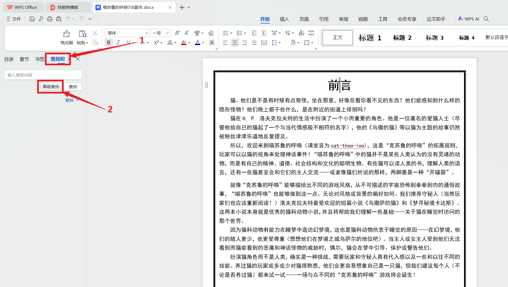

然后会弹出单独的弹窗，然后在弹窗内切换到`替换`页面，然后选择搜索栏，再打开`高级搜索`。

然后查看标题的文字属性。

然后回到弹窗，点击格式，让搜索的文字格式范围限定到标题的格式里。

然后再选择查找，然后再点击`特殊格式`，输入段落标记。

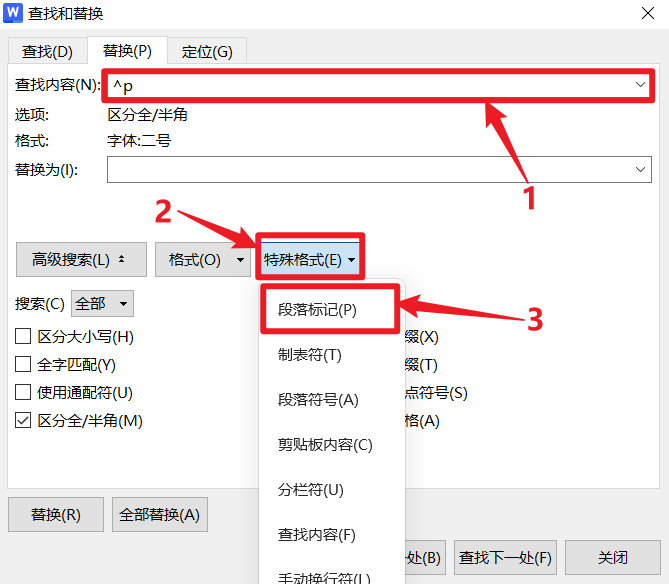

然后再填写替换项，如图所示输入`</STRONG>^p`，然后全部替换。

全部替换后可以看到标题全部加上后缀了。

之后可以参照前面的示范，依次为别的标题后缀加上`</H2>``</H3>``</H4>`……

等标题都处理完后，我们就可以给全部文段加上段落结束标签了，首先清除查找项的格式要求，然后输入`^p`，再设置替换项为`
^p`。

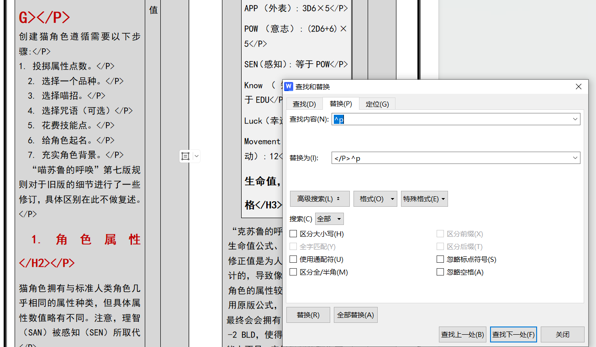

然后可以看到全部文段结尾后面都加上
了，出现图下情况不用在意，我们只需要 word 里面的文本就好了，选中全书的文本，然后复制。

## 二 在 VScode 上的编辑

打开 VScode，右键点击标签页，选择新建文本文件。

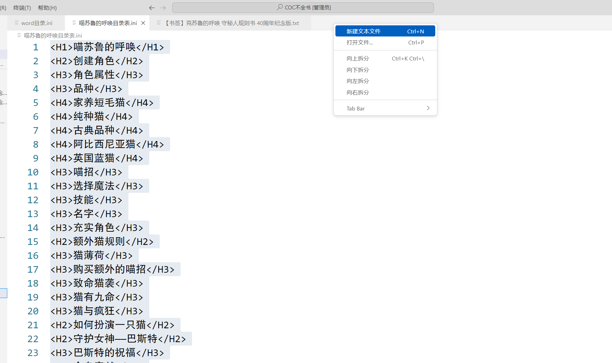

然后将之前 word 上编辑好的文本贴入其中。

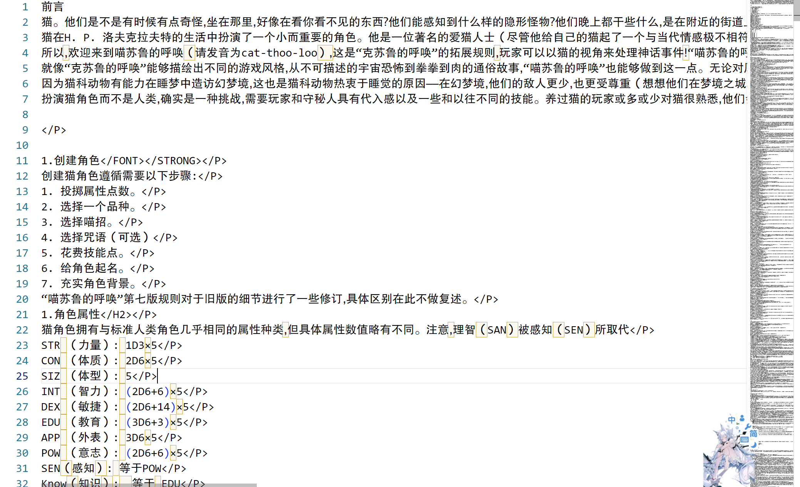

然后就可以进行进一步编辑了，我们可以先把开始标签补充上去。如下图，首先选中结束标签，然后再按`Ctrl`+`F2`键选中全部匹配项。

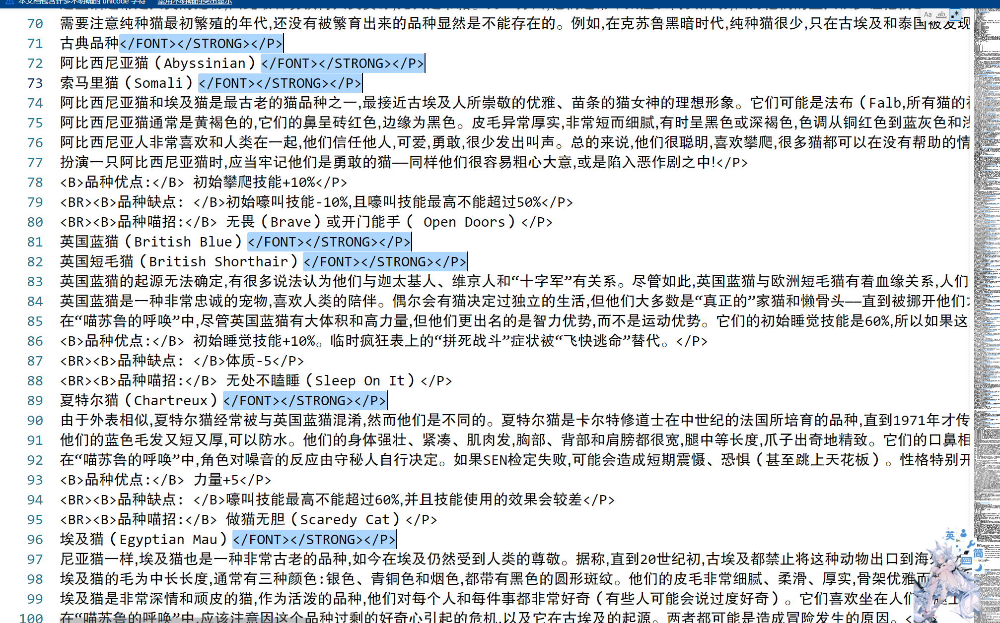

之后再按`Home`选中改行开头，再输入开始标签。

编辑时要注意，要修复一些重复或者冲突的的书签。

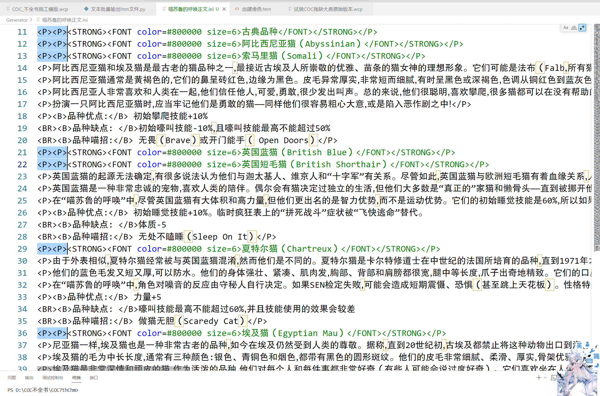

之后在 VScode 上把可以一键编辑的编辑好，初步编辑后的成功如下图所示，然后保存。

## 三 用 py 插件批量输出 htm 文件

然后确认保存的文本文件跟你克隆过来的仓库在同一个盘（指 C 盘或 D 盘）里，如果不在的话需要你靠过来一份。反正要确认文本跟插件`文本批量输出 htm 文件.py`在同一个盘里。

然后再用 VScode 打开跟插件同盘的文本文件。

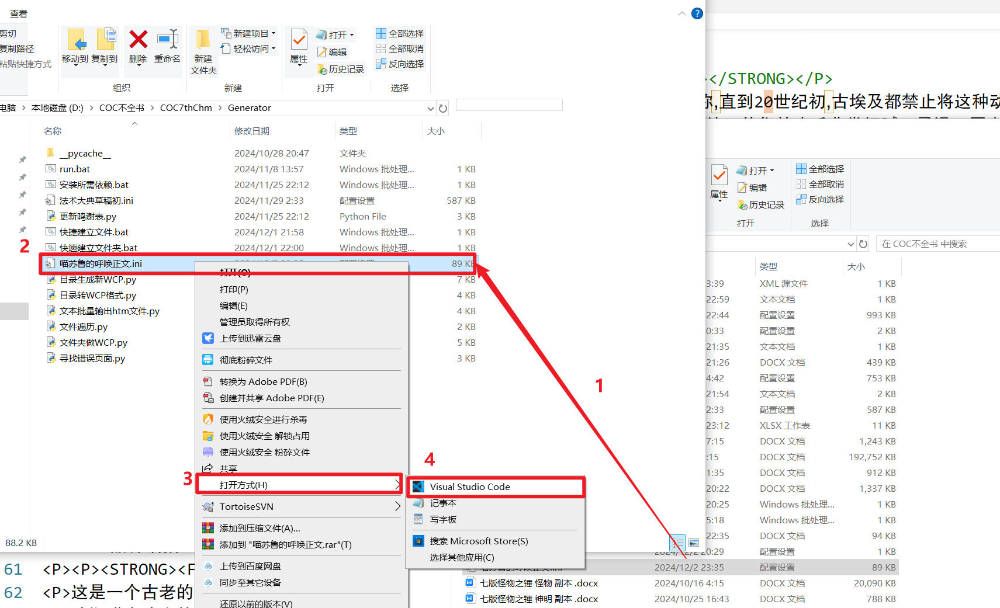

右键点击该文本文件的 VScode 里的标签页，然后点击复制路径。

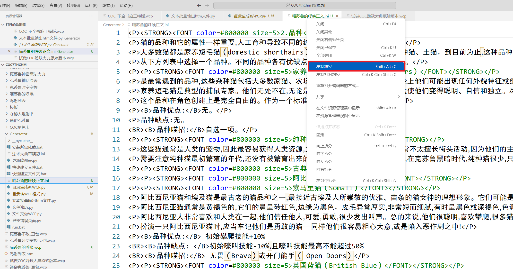

再点击`文本批量输出 htm 文件.py`（该插件需要用到 python，关于如何下载 py 请看[安装相关程序](./program.md)）。然后在插件里右键贴上你的文本文件路径，然后回车。

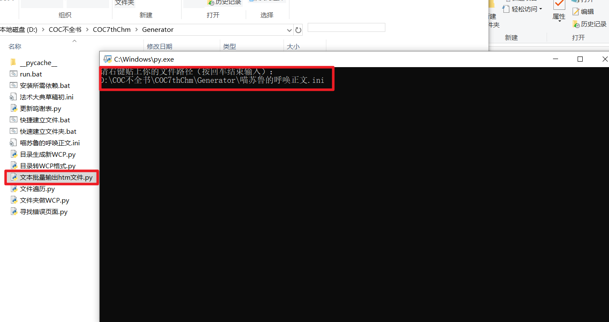

然后`文本批量输出 htm 文件.py`所处的文件夹里就会多出一个`output_files`文件夹，打开文件夹就可以看到里面的导出的 htm 文件了。

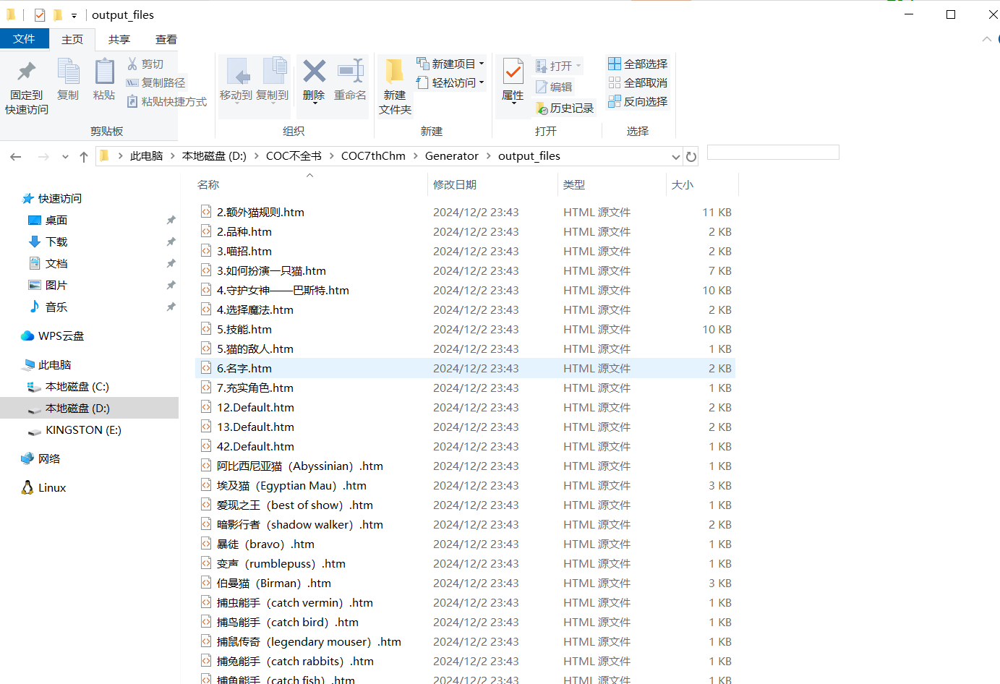

然后自行将导出的 htm 文件转移到对应的文件夹。

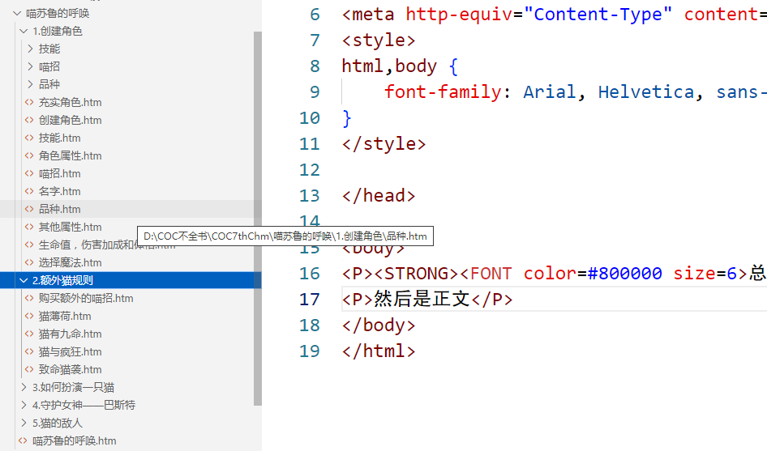

::: tip 可能遇到的问题

1. 没导出`output_files`文件夹或 htm 文件：可能是的文本文件第一行开头格式不是`
<STRONG>标题</STRONG>
`，或是你页面标题格式不合规。
2. 导出的 htm 文件名为 Default：你的标题里包含了非法字符，不能作用作为文件名使用，请自己更改文件名。
3. wcp 没法导向对应的 htm 文件：你 htm 与 wcp 记录的 url 链接的不一样，手动更改文件名字或者 url 链接。

:::

导出 htm 文件后并不意味着结束了，还要在 wcp 里再检查一遍各个项目，看有没有疏漏与错误。要确保项目内容符合[不全书的规范](../creed/creed.md)。
