---
lang: zh-cn
title: 创建 wcp 目录
---

# 创建 WCP 目录

用 Winchm 编辑时，第一次编辑项目后都要重新点一次路径，这十分麻烦，那有没有更快捷的办法，可以一次新建许多个项目，并且不用再导向新的文件夹。

首先，找到你要收集的规则扩展的 word 文件（如果是 pdf 的话建议先导成 word），然后为这个文件新建一个副本。

注意的是，一些原译给文件加上了文件保护，必须先建立副本才能在此之上继续编辑。

## 一 导出目录

首先导出原本的目录用于编辑，下面介绍 pdf 文件与 word 文件导出目录的方式。

### 导出 pdf 文件目录

首先，是原译文是 pdf 情况下，导出目录。

首先用 WPS 打开 pdf 文件，然后如下图所示，先后点击`...`导出书签。

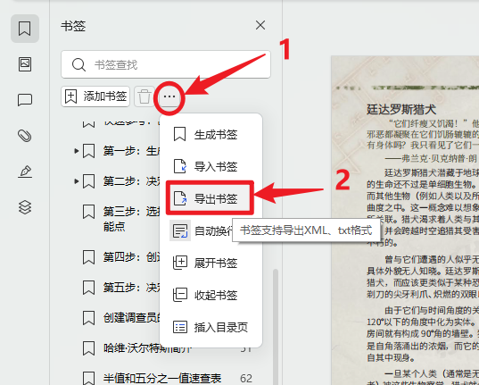

然后会弹出保持文件界面，自己选择保存位置，然后在`文件夹类型`这里点击`TXT 文件`，然后保存。

然后点开预定的文件夹，不出意外的话，就可以找到目录的 txt 文件，为了之后的编辑，我们右键点击这个文件夹然后按照下图所示，用 VScode 打开文件。

如图所示，这样就成功导出了。

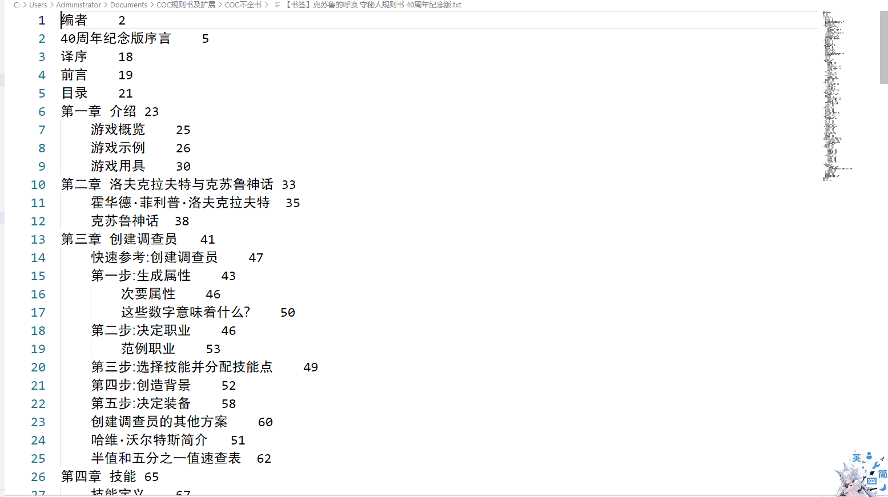

### word 导出目录

word 文件跟 wps 文件不一样，不能导出目录。如果原译是 word 文件的话，导出目录要通过别的办法。

首先，打开之前创造的 word 副本。先点击`引用`，在引用这块点击`目录`，然后点击自动目录。

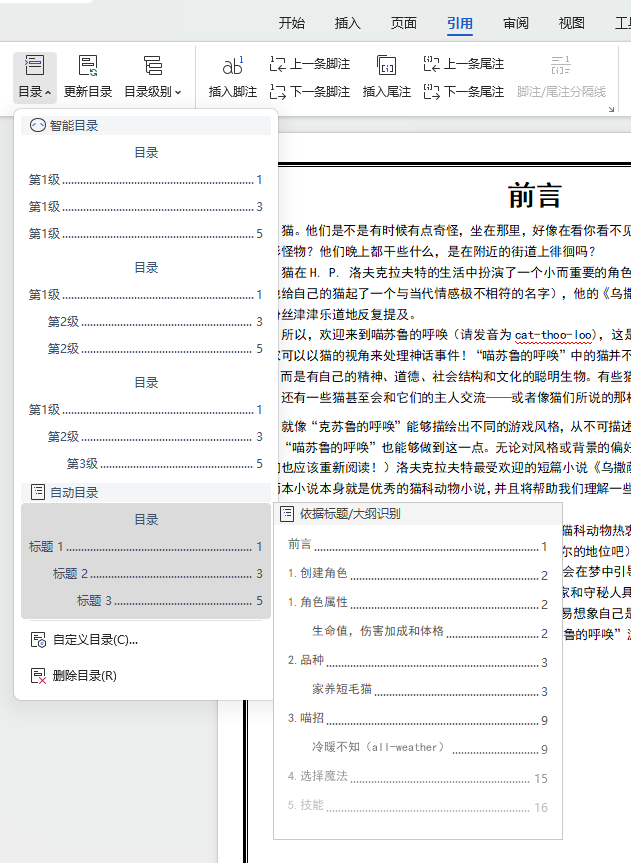

然后复制系统生成的目录。

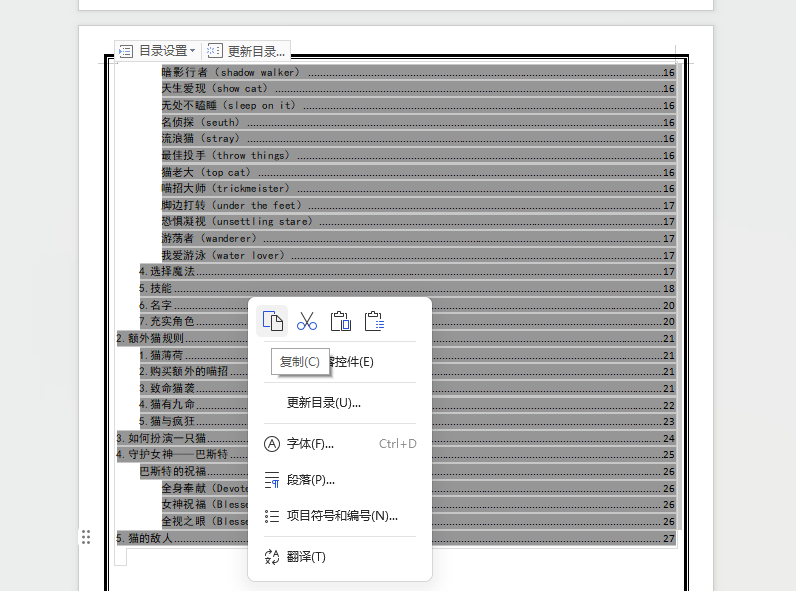

然后回到 VScode，右键点击上方的标签栏，选择新建文本文件。

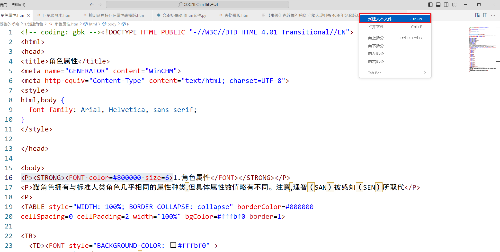

在新建的页面里，把之前复制的目录贴贴进去，然后保存就好了。

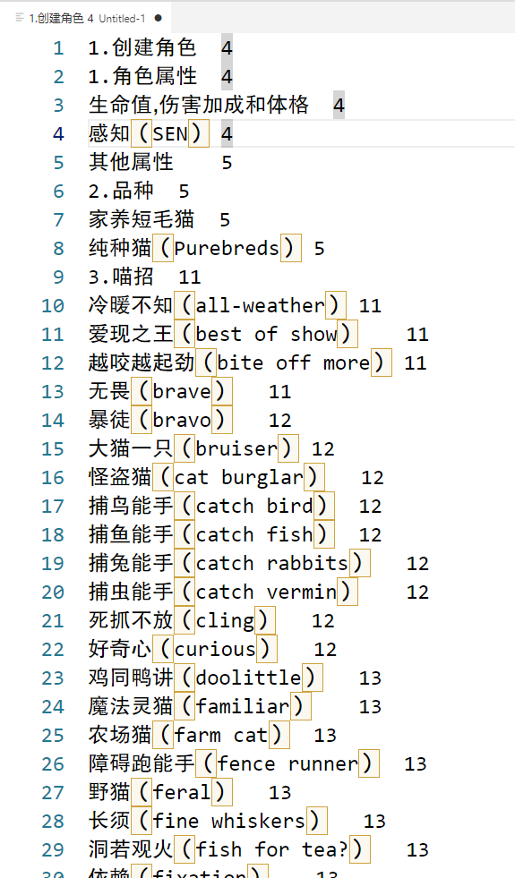

## 二 批量新建文件、文件夹

编辑不全书时，我们要新建大量的文件与文件夹，但是一个个创立十分麻烦，我们可以开始时就把大部分文件与文件夹创立好，下面我们介绍如何一次性新建多个文件与文件夹。

### 批量新建文件

下面介绍如何一次性新建多个文件，不过在后面导出 htm 文件步骤中，会自动导出多个文件夹，你可以跳过这一步。

首先，先存编辑之前导出的目录，去掉页码还有文件与文件夹不能出现的字符。

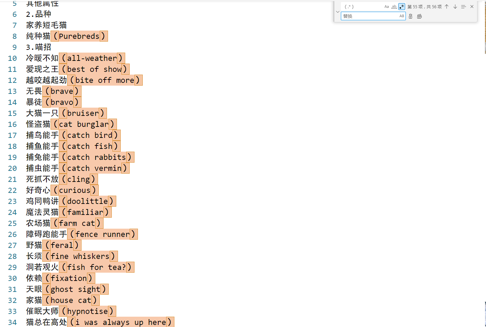

::: tip Windows 操作系统对文件和文件夹命名限制:

1. 以下字符不能出现在文件和文件夹名称中：（引号之内）  
'/' '?' '*' ':' '|' '\' '<''>'（均为英文标点，中文的不受影响）
2.以下字符不能命名为文件或文件夹的名称：（引号之内）  
"con","aux","nul","prn","com0","com1","com2","com3","com4","com5","com6","com7""com8","com9","lpt0","lpt1","lpt2","lpt3","lpt4","lpt5","lpt6","lpt7","lpt8","lpt9"
3.另外，由于 Windows 对全文件名的字符长度作出 258 个字符以内的限制。全文件名长度指的是包括了文件路径的全部长度（一个汉字也按一个字符计算）。

:::

::: tip 快捷去除页码还有括号与括号内的字符

首先在查找项中打开正则匹配，然后点击搜索栏旁边的`.*`按钮开启正则匹配，然后在搜索栏中输入`\t[0-9].*$`，然后再打开替换，替换项中什么都不用输入，然后点击全部替换。之后再输入`（.*）`重复上述操作。

`\t`：在正则匹配中代表水平制表符，水平制表符是一种特别的空格，导出的目录用这种空格来区分标题级别与隔开页码。

正则匹配的详细的原理，就是（）是中文括号，而`.*`代表中文括号内的全部字符。值得注意的是，搜索英文标点符号可能会跟正则匹配产生冲突导致出错，而中文标点符号基本上没这种烦恼。

:::

然后在列选择模式下，拖动鼠标选中标题前缀。关于如何开启列选择模式，请查看[VScode 使用技巧](./VScodetips.md)页面。

然后点击删除键，再点击空格键。让目录变为一行且中间用空格隔开，然后选中全文复制。

之后在之前从 github 复制过来的仓库里，打开文件夹`Generator`与`模版`，分别找到两个文件夹里的`快捷建立文件.bat`与`全白页.htm`，将这两个复制贴贴桌面上，然后再在桌面新建文件夹`1`。

然后右键点击`快捷建立文件.bat`，在弹窗里点击编辑。

然后将之前复制的贴近如下图所示的括号里。

然后回一瞬间闪过这个弹窗，但很快就关闭了。

之后打开桌面上那个`1`文件夹，就可以看到文件已经建好了。

### 批量新建文件夹

下面介绍如何批量新建文件夹。

首先，在之前从 github 复制过来的仓库里，打开文件夹`Generator`，找到里面的`快捷建立文件夹.bat`，将这个文件复制到桌面上，然后再在桌面新建文件夹`1`。

然后右键点击`快捷建立文件夹.bat`，在弹窗里点击编辑。

然后在括号内将你想要创建的文件夹名字填进去，至于哪些文件夹，请根据具体情况具体分析，不过你可以参考页面[合理分项](../creed/2.read.md)、[规范编辑](../creed/5.edit.md)里的内容。

之后打开桌面上那个`1`文件夹，就可以看到文件夹已经建好了。

之后就新建的文件夹（如果有新文件，也带上文件）拖到不全书仓库对应的文件夹。参照[合理分项](../creed/2.read.md)、[规范编辑](../creed/5.edit.md)，自行整理分类。

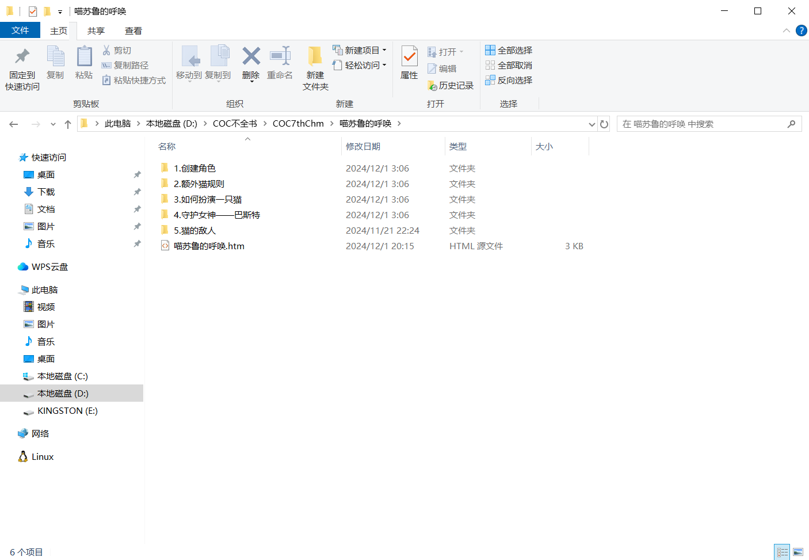

## 三 创造对应的 WCP 目录

完成以上步骤后，我们就可以自行尝试创建 wcp 文件了，在 Winchm 上编辑时项目要一个个手动添加，十分麻烦，所以不全书提供了三种办法方便你一键生成 wcp 文件。

导出的 wcp 目录并不是最终的目录，在编辑过程中你可以随时在 Winchm 里进一步编辑它。

::: tip 如何将导出的目录改成方法 1、2 使用的形式

方法 1、2 中，要将目录文本改成既定的形式，如下图所示：

为了使 py 插件可以识别文本，且可以做到建立子目录，使子项之间关系明确，我们不能直接拿导出的目录使用，而是要将目录按照上面的要求编辑后，再用 py 文件转换。下面介绍快速编辑的办法：

### 编辑 PDF 导出的目录

首先去除目录的页码，先打开查找，然后点击搜索栏旁边的`.*`按钮开启正则匹配，然后在搜索栏中输入`\t[0-9].*$`，然后再打开替换，然后全部替换。

\t：在正则匹配中代表水平制表符，水平制表符是一种特别的空格，导出的目录用这种空格来区分标题级别与隔开页码。

然后可以看到，目录因为级别不同，前面的空格（也是水平制表符）有所不同，下面我们从低到高，利用正则匹配快速编辑目录。

首先确认最低一级标题是第几级，上面的目录最低一级为第三级，第三级目录前有两个空格。

于是我们在查找项输入`\t\t(.*)`,再在替换项里输入`<H4>$1</H4>`，然后全部替换。

之后再处理第二级标题，查找`\t(.*)`，全部替换成`<H3>$1</H3>`。

再是第一级标题，查找`^([^<])(.*)`，全部替换成`<H2>$1$2</H2>`。

然后再在目录最前面加上`<H1><扩展标题><H1/>`。然后再精简目录信息，如去掉第几章、第几步、序号等没实际意义的信息，此外删除一些可以直接跟其他板块块合并的内容。最后的结果如下。

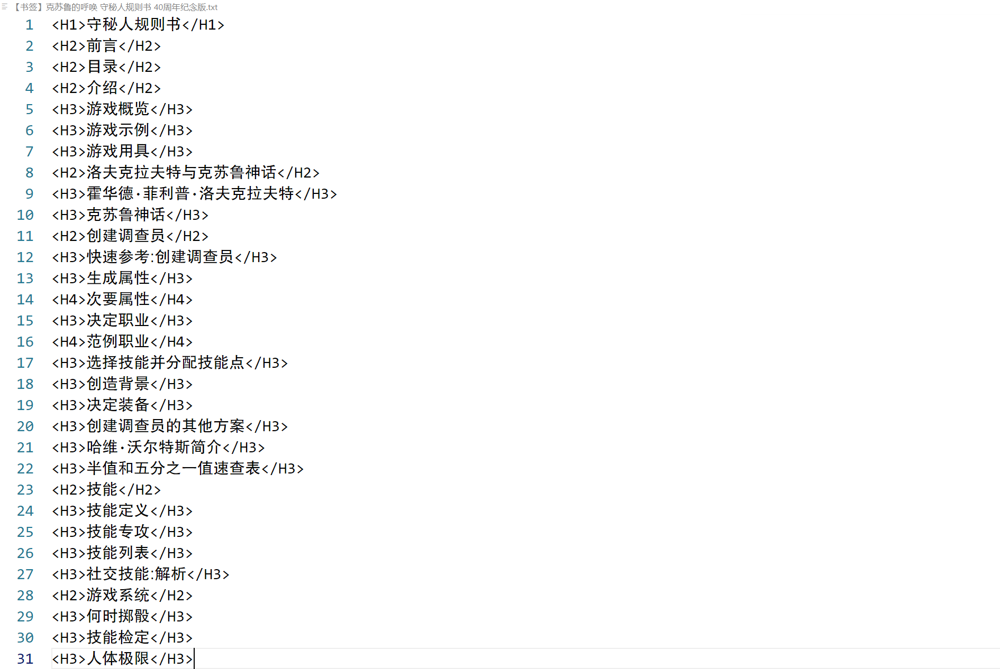

### 编辑 word 导出的目录

编辑 word 导出的目录相比 pdf 的要麻烦一些，因为 word 导出的目录并不像 pdf 那样等级明确。

首先跟编辑 pdf 一样，去除目录的页码，先打开查找，然后点击搜索栏旁边的`.*`按钮开启正则匹配，然后在搜索栏中输入`\t[0-9].*$`，然后再打开替换，然后全部替换。

然后参照 word 原本的目录，自己按照要求对目录进行分级。最后再精简目录信息，如去掉第几章、第几步、序号等没实际意义的信息。

:::

### 1.目录一键生成 wcp 文件

首先按照上面教程，编辑一版供插件识别的目录出来，然后复制。

在克隆过来的仓库里，打开`Generator`文件夹，点击`目录生成新 WCP.py`（该插件需要用到 python，关于如何下载 py 请看[安装相关程序](./program.md)）。

然后会弹出一个新窗口，按照窗口指令分别输入要生成的&nbsp;wcp 文件名、右键贴上之前复制的目录，最后回车两次。

然后回到外面的文件夹，可以看到 wcp 文件已经建成了*（注：该插件默认你遵守了[合理分项](../creed/2.read.md)、[规范编辑](../creed/5.edit.md)来创办文件夹，收纳文件，如果你做了细微的改变，请自行新建插件副本，然后自己尝试编辑）。

::: tip 如何将 wcp 目录导入另一个 wcp 文件里

如果你想将新建的 wcp 文件目录导入到另一个 wcp 文件里，Winchm 提供了方便的导入办法。

首先打开你要导进去的 wcp 文件，然后点击`文件`>`从另一个项目导入 TOC（T）…`，然后在弹出的新窗口选择你要导入的&nbsp;wcp 文件，然后保存。

:::

### 2.编辑 COC_不全书施工模版.wcp

在克隆过来的仓库里，打开`Generator`文件夹，点击`目录转 WCP.py`，会弹出个新窗口（该插件需要用到 python，关于如何下载 py 请看[安装相关程序](./program.md)）。

然后把按照上面教程，编辑过目录复制过来，按照窗口指令右键贴上，最后回车两次。

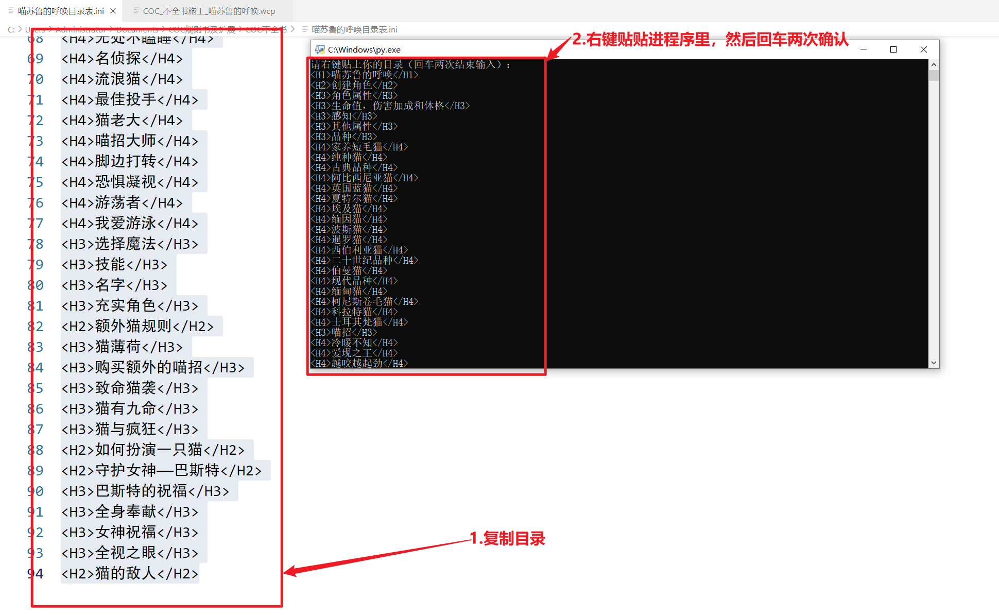

然后`Generator`夹里会多出一个`output.txt`，点开看就能看到之前的目录已经改成 wcp 的格式了*（注：该插件默认你遵守了[合理分项](../creed/2.read.md)、[规范编辑](../creed/5.edit.md) 来创办文件夹，收纳文件，如果你做了细微的改变，请自行新建插件副本，然后自己尝试编辑），然后复制该文件里的全部文字。

之后回到外面的文件夹，复制贴贴`COC_不全书施工模版.wcp`，新建副本且改文件名字，然后右键点击要施工的 wcp 文件，选择用`VScode`打开。

然后可以看到这种页面。

然后拖动页面，将 TitleList.Kind.8=0 之后的全部行列全部删掉，再贴上之前导出的文本。

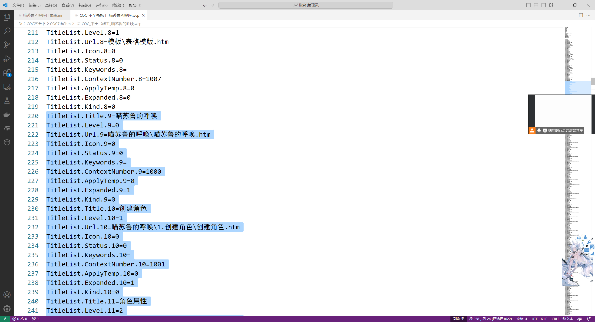

最后确认最后面 TitleList. 的数字后缀是什么，然后回到 [TOPICS] 开头，将那个数字输入 TitleList=后面。

然后打开要施工的 wcp 文件，就可以看到 wcp 已经编辑好了。完成后记得回去删除`Generator`新导出的`output.txt`文件。

### 3.通过导入文件夹来生成 WCP

以上办法需要你自己编辑一份目录出来，不过你也可以不编辑目录，先制作文件夹与文件，且整理整齐后，再通过插件生成 wcp 文件，该办法不强求你遵守[合理分项](../creed/2.read.md)、[规范编辑](../creed/5.edit.md)。但是这种办法生成的 wcp 目录顺序是根据文件的首字母顺序来的，顺序需要你自己在 wcp 内部调整。

在克隆过来的仓库里，打开`Generator`文件夹，点击`文件夹做 WCP.py`（该插件需要用到 python，关于如何下载 py 请看[安装相关程序](./program.md) ）。然后在新弹出的窗口找到对应的文件夹，然后回到

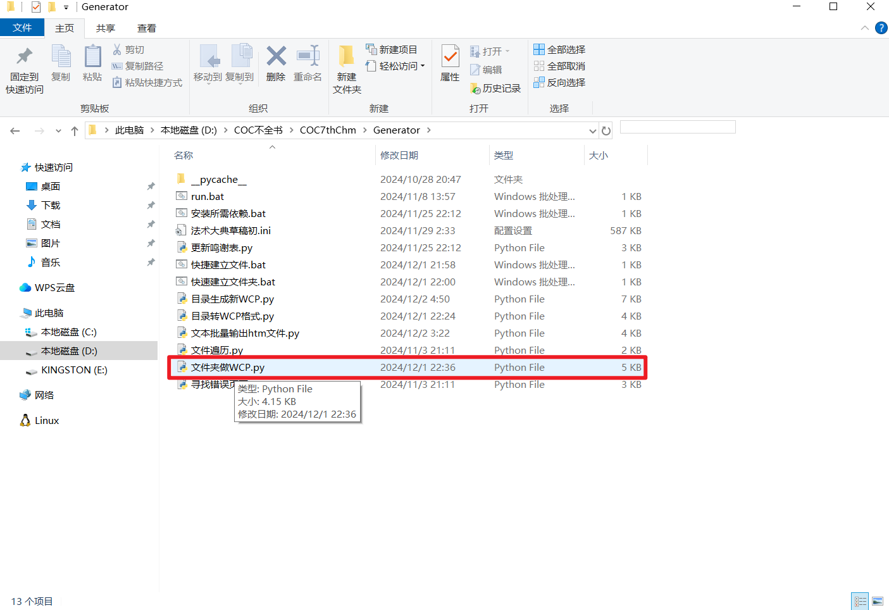

然后回到外面的文件夹，可以看到 wcp 文件已经建成了。

## 四 其他

### 如何编辑&nbsp;py

以上的办法都要用到 py 创建 wcp 文件，你可以根据自己需要，在原来插件基础上，参考 py 文件内的注释进行编辑，以满足你自己的需求。

首先将你要编辑的插件复制贴贴新建一个副本。然后右键点击副本，然后点击编辑或者是用 VScode 打开文件。

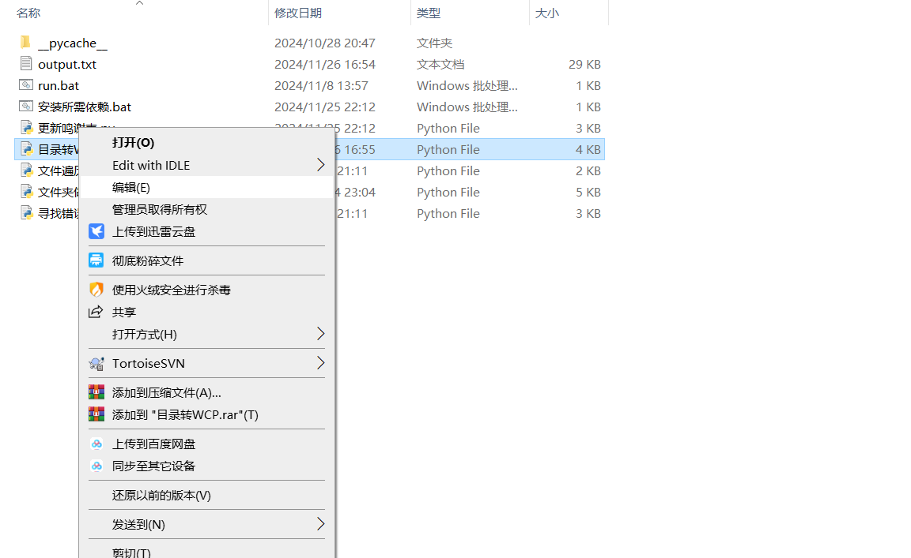

### 认识 WCP 文本

wcp 是一种文件类型，识别起来十分简单，下图描述了 wcp 文本里包含的一些基础信息。

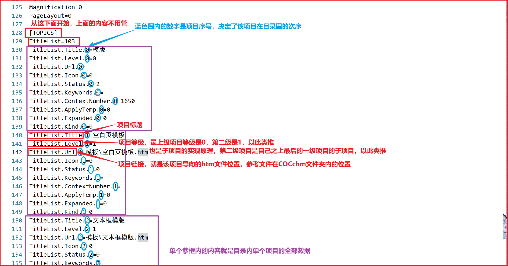
