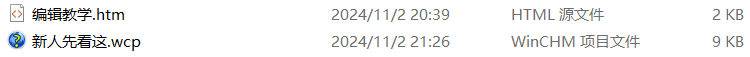

# 用 Winchm 编辑不全书

在如何编辑不全书那块，我们已经讲了如何用 Winchm 打开 chm 文件了，还介绍了如何用 Github 在本地获得不全书文件，以及上传文件。下面我们将会在认定你看过并会使用 chm 文件，会基础的编辑文字能力（例如会选中文字、复制、贴贴，如果不会先到网络上搜索），且已经看完上面的内容后，跟你介绍如何编辑不全书。

如果你会 html 语言，或者已经熟悉了 Winchm，想尝试更快捷的编辑不全书，可以跳过这一栏，查看[用编程来编辑不全书](../VScode/code.md)。

## 不全书的文件构成

不全书主要由两个文件构成：

第一种是后缀是&nbsp;htm 的 html 文件，这个记录了不全书内项目的内容，你现在看到的一字一画，都是这个文件记录在内的，他决定了这个界面的布局。

第二种是后缀是 wcp 的文件，这个记录了不全书的目录信息，也就是侧栏那一块，点击它就可以在 Winchm 内打开对应的不全书。

这两个文件是不全书的主体。 一般来讲，一个页面就有对应的一个 htm 文件，而 wcp 用于制作目录与可视化编辑 htm 文件。

下面，我们将介绍如何利用 Winchm 编辑制作不全书。
