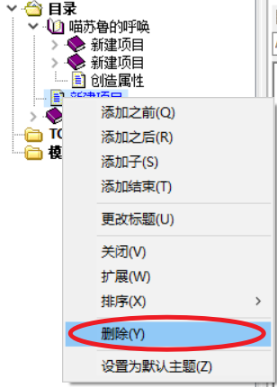
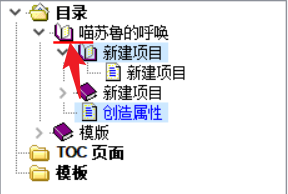
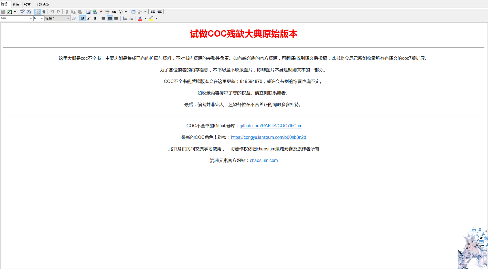
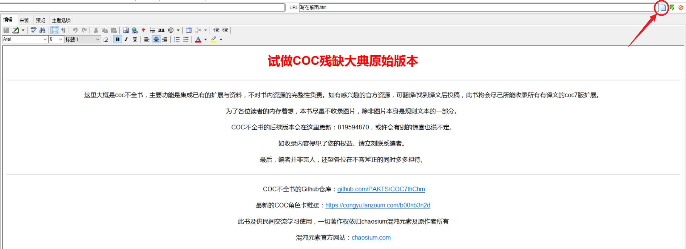
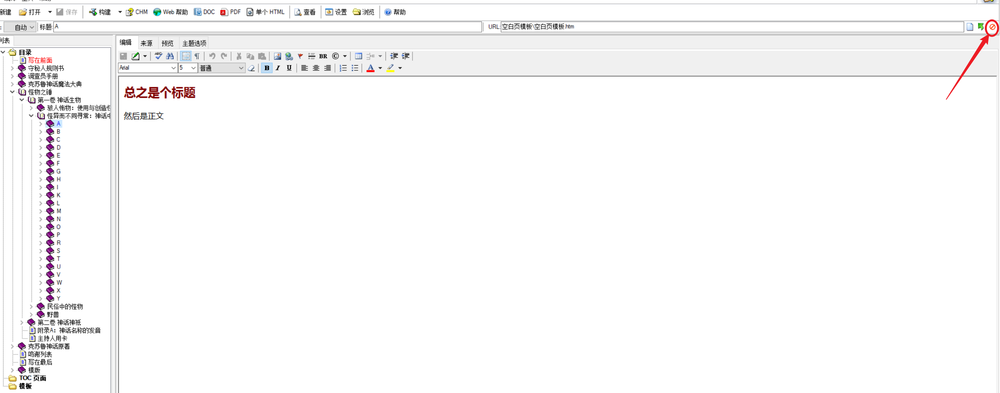
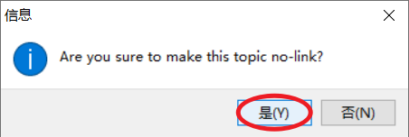
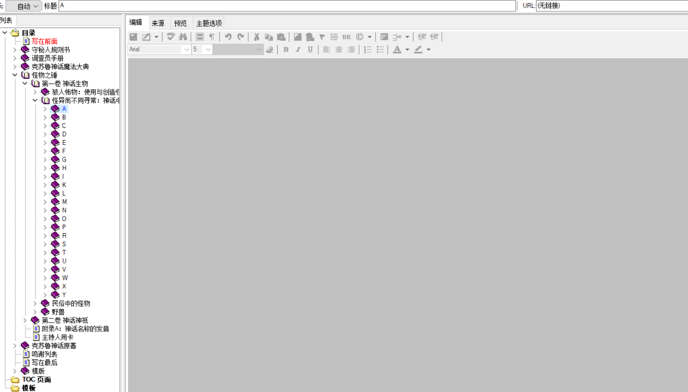

# 编辑目录

一个合格的书籍一般会有层次分明的目录，以方便编辑与查询。

COC 不全书同样也需要一个层次分明的目录。之前我们已经介绍了如何初步编辑一个文件，包括新建页面还有更改目录中页面的名字，下面我们会通过目录编辑这块来介绍如何新建子项目，如何删除项目，如何改变项目在目录顺序与等级，如何让一个项目恢复成空白页，如何让目录导向已有文件，还有如何让一个目录项目不导向任何文件。

## 一 新建子项目

就跟书籍有第一级标题第二级标题一样，chm 文件同样有对应的第一级项目第二级项目。如果目录里点开一个项目，这个项目里面还有其他项目，那么我们称里面的项目为这个项目的子项目。子项目可以方便规划一块大文本内的内容。子项目也可以有自己的子项目，子项目内的子项目也可以有自己的子项目。不过注意在不全书里，项目的子项目的子项目依然是这个项目的子项目（我的子项目的子项目依然是我的子项目）。

右键点击要信建子项目的项目，在弹窗中点击`添加子`。

这样就可以在一个项目下添加他的子项目了。

## 二 删掉项目

右键点击你想删除的项目，然后点击删除。

这样就可以成功删除对应项目了（注意：这个项目内的子项目也会一同删去，此外删掉的只是这个 wps 文件内的目录信息，这个项目对应的 htm 文件并没有被删除）。

## 三 更改项目顺序

首选选择你要更改的项目。

然后将这个项目拖动到你想要的位置。红线显示的就是你松开鼠标后项目所在的地方。

如果你想让一个项目成为别的项目的子项目，而这个项目还没有子项目的情况下，那把项目拖进这个项目的标题内，当这个项目出现蓝框时，松开鼠标，移动的项目就变成这个项目的子项目了。

## 四 将一个项目的链接导向已有的文件

有的时候，我们会遇到各种情况，导致项目的链接不能导向原有的文件了，在已有现成文件的情况，肯定不想新建一个项目。

这个时候我们就要更改项目的 URL（uniform resource locator：统一资源定位系统），也就是链接。

在右上方可以看到 URL，在 URL 友方点击绿色的箭头。

然后会弹出文件页面，找到我们要重新导向的文件。然后点击`打开`

这样的话就可以将项目链接导向现成的文件了。

## 五 将页面恢复成空白页

点击 URL 右侧的白纸。

点击`是`。

就能恢复成空白页了。

## 六 删掉项目内的页面

有时候，我们在目录新建一个项目只是为了更改的区分，这个项目内没有任何的内容，这个时候我们可以清空这个项目的页面。

点击 URL 右侧的禁止标记。

点击`是`。

这样这个项目就空空如也了。

