# 新建项目

1.首先，在新装的不全书库里找到`COC_不全书施工模版`，右键选择重命名，将其改为`COC7th_不全书 你的施工现场`。这是为了方便你可以一直拿这个文件施工，也是为了避免合并时跟主仓库冲突。

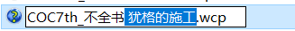

2.然后点开 wcp 文件。可以来到这个界面。

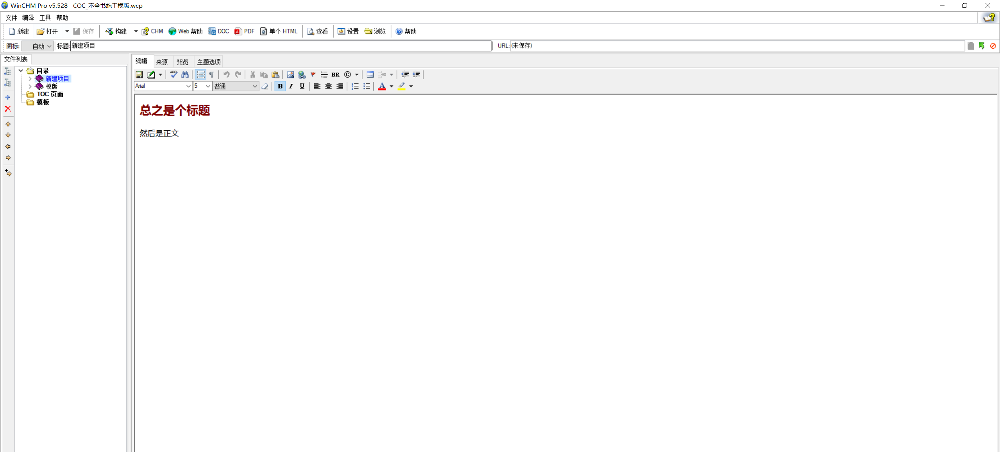

如下图所示，一个合格的界面会是这样的效果，下面我会教你如何一步一步的达成这样的效果。

## 更改默认模版

我们先更改 winchm 的默认空白模版。

1.点击上方的`设置`。

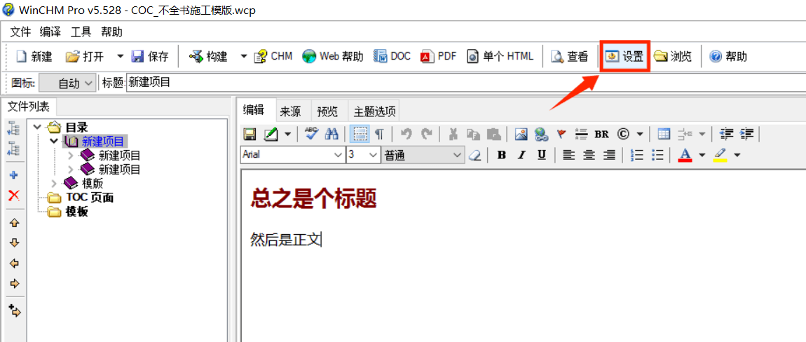

2.然后在新弹出的窗口里，当创建一个新的主体内，勾选`自定义页面`，然后看文件名里是否有`模版\空白页模版.htm`的内容。

如果没有的话，勾选自定义页面，然后点击文件名右边的`...`，选中`空白页模版.htm`，然后点击确认。

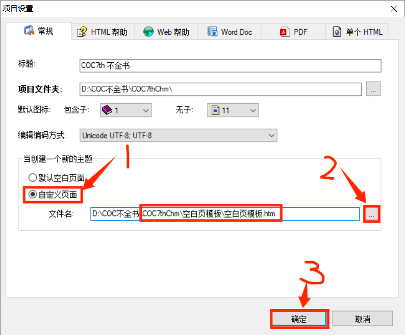

## 创建新页面

1.来到左侧的目录栏，右键点击其中一个项目。然后在弹窗内点击`添加之后`或`添加之前`。这样就可以新建你点击的项目的同级项目了。

2.然后就会出现一个弹窗，点击确认。

3.然后会出现新的同级项目，如果弹出的是这个页面的话，就说明你可以继续施工了，如果不是，请回到上一步：更改默认模版。

此外创建项目时，一开始就可命名项目的名字。

## 进阶一次添加多个项目

让我们回到创建新页面的步骤二。可以看到这个弹窗内计算旁有个白框，在这个白框内填入你加的数量，然后点击确认，就可以一次性添加多个项目了。

# 正式编辑

完成上面的步骤后，我们可以开始正式编辑了，下面我们拿编辑《喵苏鲁的呼唤》的过程为例。

编辑时，请准备好你要汇总的文本。

::: warning 注意事项

一般来讲，主流上的 COC 相关的书籍都是用 PDF 格式，直接将 pdf 内的文字复制过去，文段经常是分割成一行一行的，编辑起来十分麻烦。

目前推荐的办法是先把 pdf 转为 word 格式，这样的话将文段贴过来时不至于分割成一行一行的了，但是暴力转换成 word 格式可能会出现文章乱码乱序的问题，遇到乱码时请自行校对 PDF 原版内的内容。

如果是复制果园的内容的话，群内有直接将果园帖子文字转成 htm 文件的工具。

:::

## 一 更改项目标题

右键点击项目，再点击更改标题，就可以更改项目名字了。

## 二 将文本复制过来

首先复制你要的文本。

然后选中正文，右键贴贴。

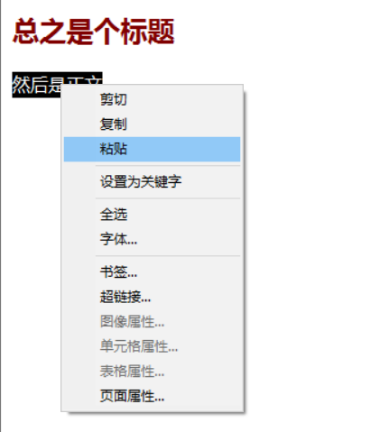

就可以看到我们把内容复制过来了，但是文字的格式还是保留 word 文档的格式，不是我们想要的格式，如果文章的格式不统一，这会导致不全书阅读起来十分难看。这就要我们多走一道流程，把文字的属性去掉。

我们先新建一个笔记本，先将复制的内容贴到这里面。可以看到这段内容失去了它原有的格式。

然后我们再剪切笔记本内要复制的这段内容。

然后再回到 winchm 将内容贴贴上去，可以看到变成我们的默认字体了。

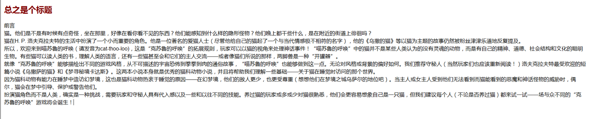

## 三 更改标题

接下来，将会叫你如果更改页面内红色的标题。

首先选中原文标题的部分，然后剪切。

然后点击上方栏目中的来源。看这个界面的原代码。

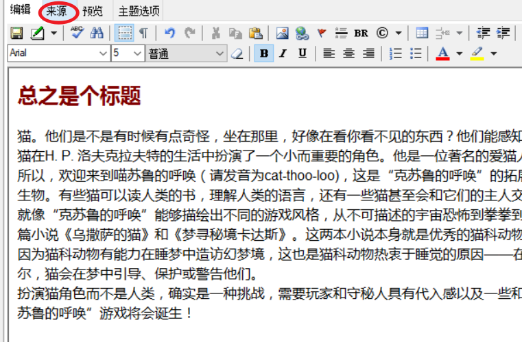

然后选中源代码“总之是个标题”的部分，贴贴之前剪切的文字。

确认这部分的文字已经变成了你的标题。

然后重新点击上栏的编辑，可以看到标题已经已经成功更改了。

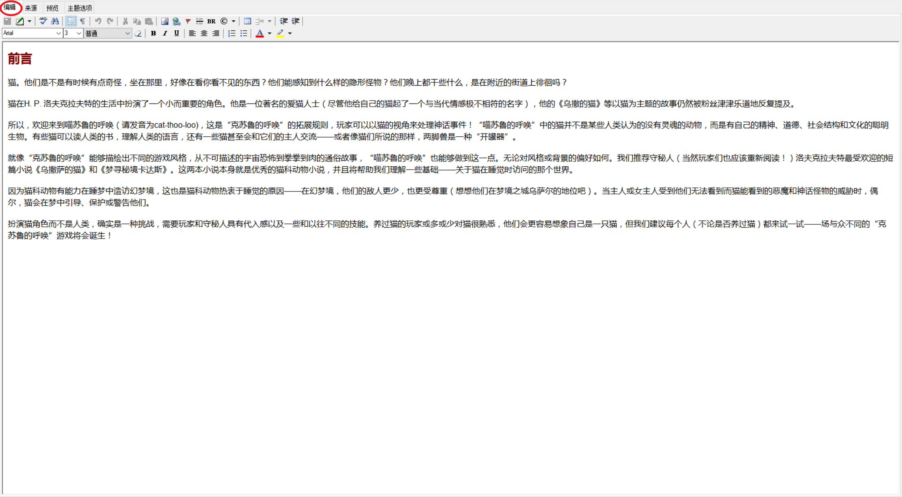

## 四 将折行变为新的段落

完成以上步骤后，我们把新完成的页面的格式跟标准的页面的格式做对比，依然会发现不对劲的地方。

如下图所示，标准的页面里，段落之间会有个空行，而之前目前的页面段落之间还是互相埃在一起的。

如果你在 winchm 回车的话，也会发现两个段落会自带空行，但是我们从 txt 复制的段落却紧挨在一起。原因是前一种格式是两段段落，这是回车默认的情况，而后一种格式是折行，这两段话在文件这里还是判定为一段段落。

加下来我们要做的，就是去掉折行，把文字分为几个段落，

首先，点击段落的开头。

然后，点击`Backspace`（也就是你平时删文字的按那个键），可以看到这个自然段回到了上个自然段的末尾。（一定要这么做，这样才可以删掉之前折行，否则到时候两个段落间会多一个空行）

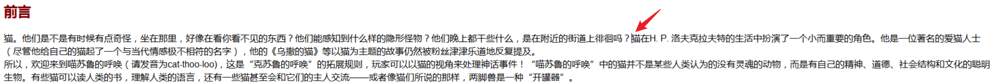

然后再按回车，就可以看见两个句子分开，之间隔了一行空行了。这两句话已经成为两个段落了。

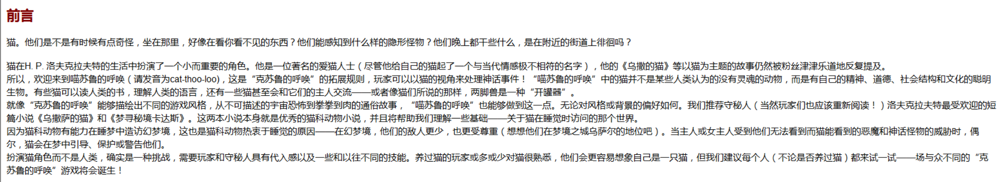

接着对其他文字段也这么处理。不过在一些情况我们会希望文字之间更加紧凑时，会用折行分开文段而不是分为两个段落，关于这部分，请看编辑守则。

## 五 保存文件

当我们完成编辑后，点击上方的保存，就可以保存项目了。

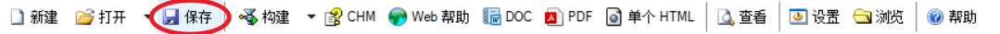

如果你是第一次保持这个项目，那么电脑接下来会跳出文件夹弹窗，问你要将这个项目的文件保存在哪里。

如果你是开了个新项目，这里建议你新建这个项目的文件夹，然后将文件储存在文件夹里面。你可以直接在新弹出的页面新建文件夹。

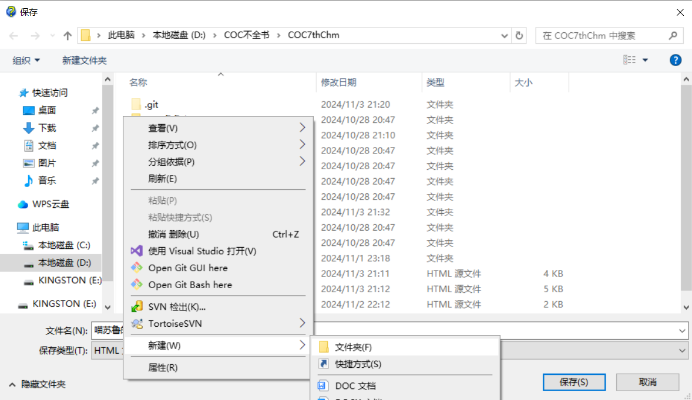

新建的文件夹建议改为扩展的名称。

然后点击你要保存文件夹，然后点击保存。

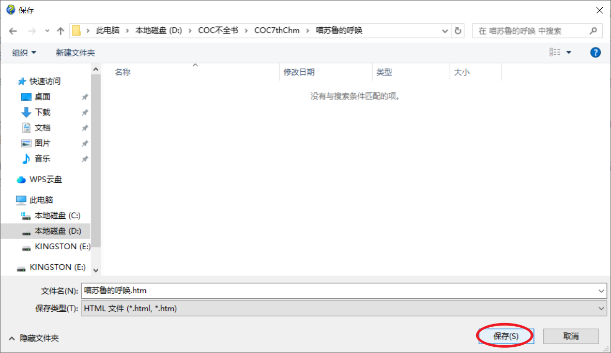

这样，打开电脑，你就可以发现新文件夹与新文件已经成功建好了。你之后可以在 winchm 继续编辑了。

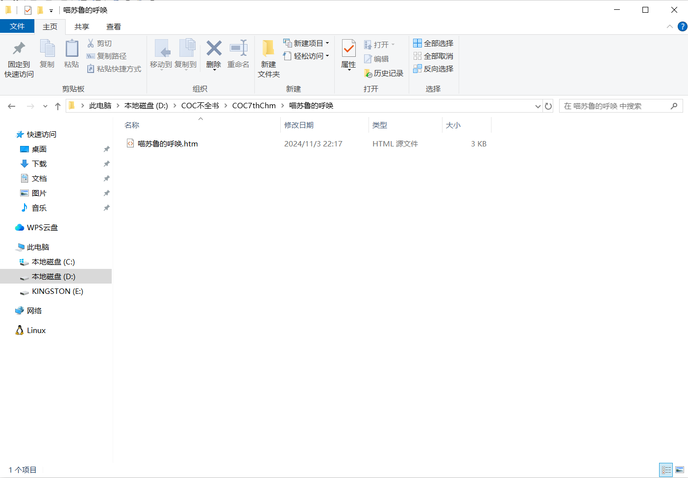
