# 为页面添加其他元素

上面我们介绍了如何在 winchm 编辑文字，但一个好的 chm 文件不光由文字组成，也包含了别的事物，下面我们将会介绍如果添加文本框、表格、照片、超连接到页面里面。

## 一 添加文本框

我们在书中经常能看到这种文本框，文本框里一般不是规则的内容，而是起到示例或补充的作用。

为了避免文本框的内容与主内容弄混，文本框内的内容我们一般也是塞进一个单独的文本框内，下面我们将教学如果跟文字加文本框。

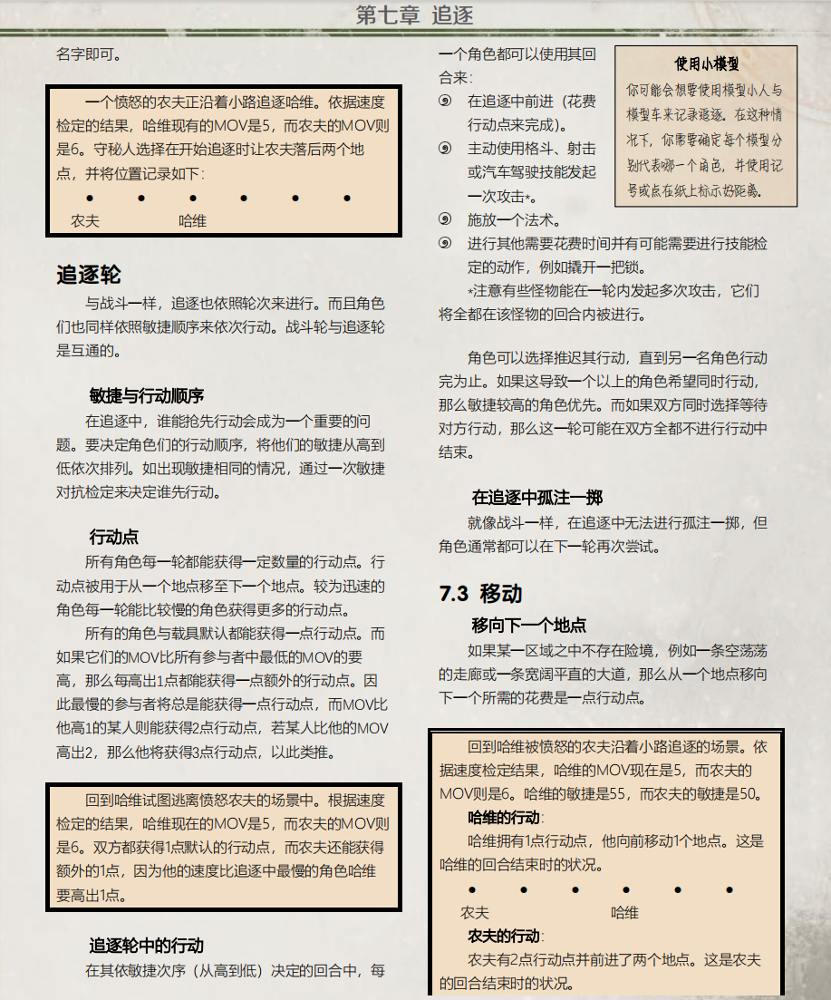

不全书的文本框格式都是统一的，点击模版\文本框模版，就可看到文本框。

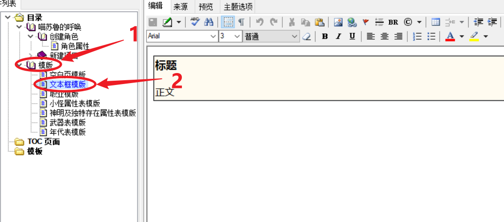

然后将鼠标移到文本框上，如图所示，当鼠标变成这个方位键时，点击鼠标右键，即可选中文本框。

然后点击复制。

然后回到要添加文本框的页面，在添加文本框的位置右键贴贴。

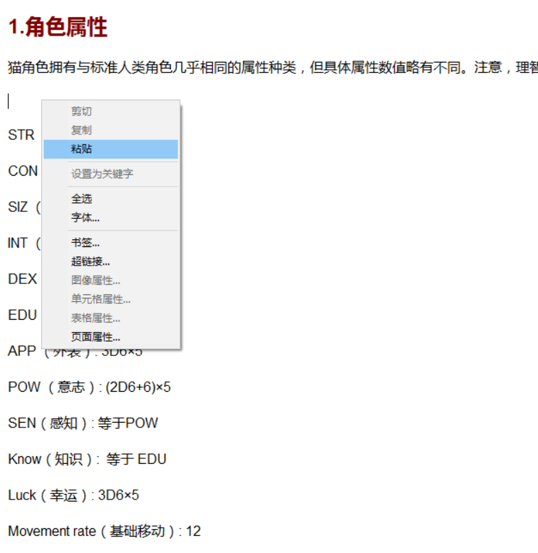

这样就把文本框复制过来了。

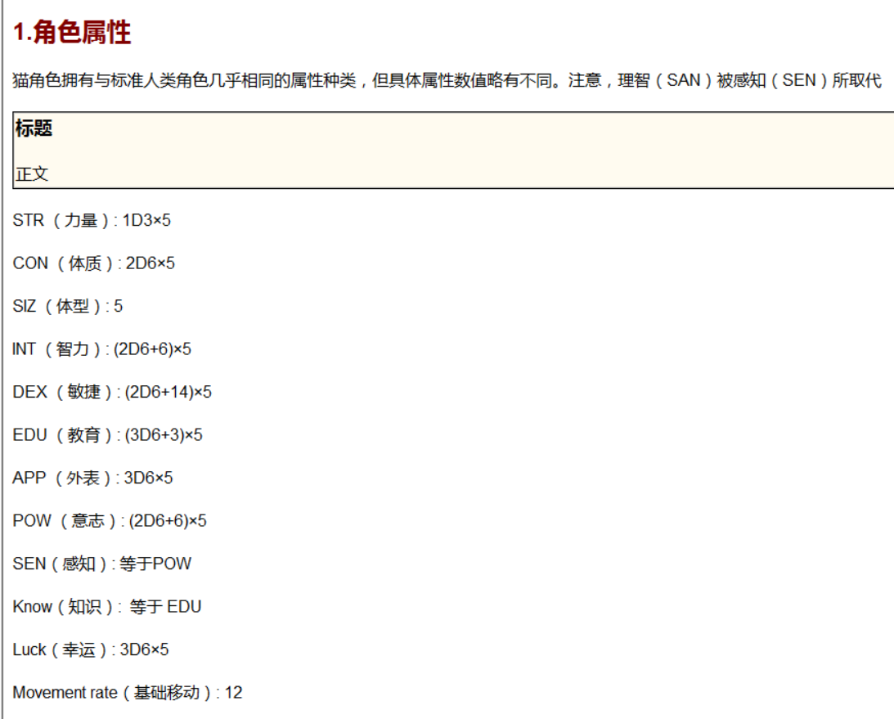

之后将文本框内的文字剪切过去就好了。

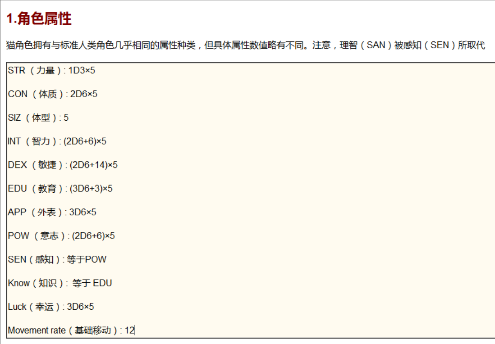

## 二 添加图片

为了照顾内存，不全书尽可能不收录图片，但是遇上图片也是规则的一部分，且无法用其他方法展示出来时（例如流程示意图，体型对比图等），不全书会收集对应的图片。

为页面添加图片的方法如下，首先将你要将你要添加的图片放入不全书文件的，最好放到跟你要添加图片项目的文件夹内。

然后点击上方的图片图标。

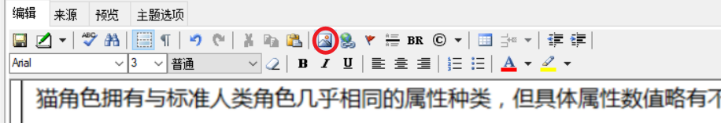

然后在新弹出的窗口里找到你要添加的图片，然后点击打开。

## 三 添加水平线

首先选中你要添加水平线的地方，然后红框内的图片，就可以了。

## 四 添加超链接

我们阅读时可遇上那种蓝色且有下划线的字体，点击这段字体就可以完成对应页面、网站的快速跳转。这种文字叫着超链接。下面我们介绍如果给一段文字添加超链接属性。

添加超链接的方式有两种，一是选中后点击下方红框内的图标，二是右键选择超链接。

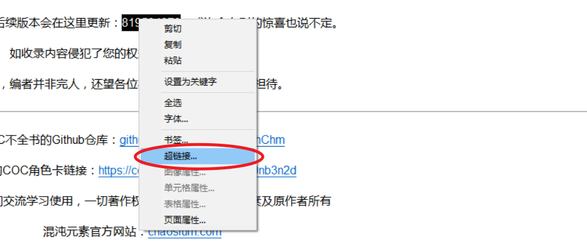

如果希望超链接导向不全书内的项目的话，点击地址最左边的图标，然后选中导向的项目，然后确认。

或是在地址右边的文本框里填写这个文件的路径，如果导向的文件是此文件的同级或下级文件（以文件夹的方位为主），则只用填所处这个文件夹后面的路径，如果位于这个文件夹外，则要填不全书后文件夹所有的路径。

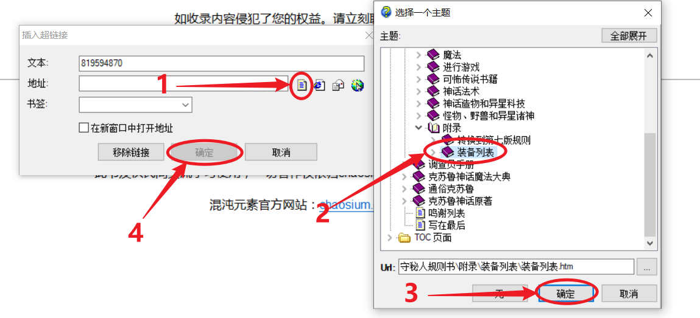

::: tip  

例如，a、b 是两个文件，我们要在 b 建立个超链接导向 a 文件，a 属于 A 文件夹。

如果两个文件 a 都在 A 文件夹下，那么路径只用填 a.htm 就可以了。

如果 b 依然在 A 文件夹下，但是 a 在 A 文件夹内的 B 文件夹，那么路径要填 B\a.htm。

如果&nbsp;b 不位于 A 文件夹，位于&nbsp;C 文件夹，但是 A、C 文件夹都位于 D 文件夹内部，D 是不全书文件的最上级文件夹之一，则路径要填写 D\C\b.htm.

:::

希望导向网站的的话，在地址右边的文本框里填写对应网址就可以了。

确认后文本变成蓝色带有下划线的字体就说明 winchm 识别这位一个超链接了，只有导出 chm 后这个超链接才能点击生效。

## 五 表格相关

我们阅读文本时，经常会看到表格，表格可以很好的将不同文字对应在一起，收录这种表格时，我们要采用统一的模版。

::: warning 注意

可以直接复制 word 还有&nbsp;EX 的表格在不全书里面，但由于直接复制过来的表格格式并不统一，难以编辑，与 chm 文件的兼容性很差&nbsp;，因此我们更建议在 winchm 内新建一个表格。

:::

### 添加表格

虽然点击上方的表格图标可以添加空白表格，但我们不建议这么做，因为将空表格变为规定的格式十分麻烦。

我们建议在`模版`里点开表格模版页面，复制合适的表格加以编辑，将表格复制到对应的页面方法与文本框一致（实际上，文本框也是一种表格）。

注意的是，属性表用到的是另一种模版，具体请查看`小怪属性表模版`与`神明及独特存在属性表模版`。

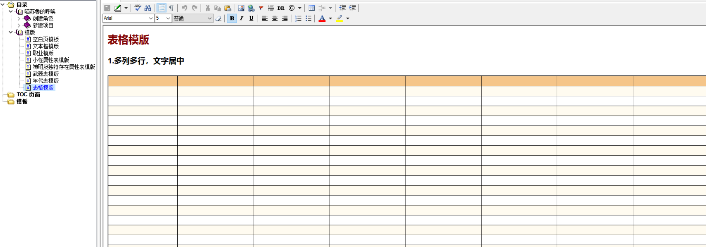

### 编辑行数列数

首先选中表格内的单元格，然后点击蓝圈内的图标。

然后回弹出如图所示的列表，按照自己的需求编辑即可。

### 编辑表格属性

下面我们介绍如何编辑整个表格的属性。

首先右键点击表格然后在弹窗里选择`表格属性...`。

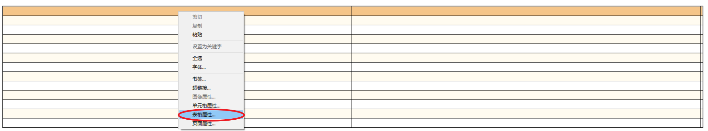

然后会出现下图所示的弹窗。在 winchm 里可编辑的属性如下图所示（但是行和列没法在这个弹窗里编辑，应该是 bug）。但在不全书里，绝大多数情况只用编辑表格的列宽。

注意的是，为了不同的设备，表格宽度后面的单位是百分比（意思是在阅读器页面的占比），而不是 xp（像素）。

### 编辑表格列宽

除非列与列之间的字数差距十分巨大，为了更良好美观的阅读体验，表格内列宽要保持一致。

在列宽这里，白框中每行`Col：`都代表着一列，点击其中一个`Col：`，然后再在右边进行编辑。

计算 100 除以该表格的列数，然后向下取整，将取整得来的数填入`Col：`中。此外编辑时要确认下面勾选的是`百分比（%）`。

然后点击应用，就可以更改表格分布了。

### 编辑单元格属性

如果我们不想选中全部的表格，只是想单独编辑某个单元格或者某行某列的话，我们右键点击要编辑的地方，然后点击`单元格属性`。

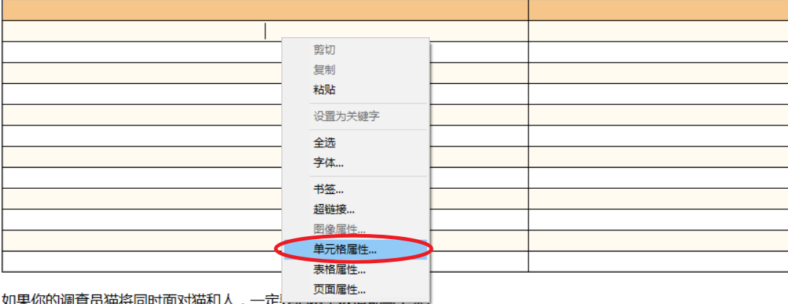

然后就会出现如下图所示的弹窗，在红框内勾选就能编辑对应的选项。

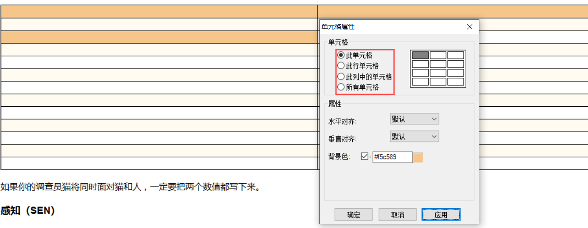

### 编辑单元格背景颜色

在一般时候，我们会编辑单元格颜色，以突出文字。

首先，按照上面的步骤打开编辑单元格弹窗。在选中要编辑的选项后，勾选背景色。

然后在旁边的文本框内填入颜色值（也就是一种颜色对应的代码），或者是点击右边的颜色区块在新弹窗内选择颜色。

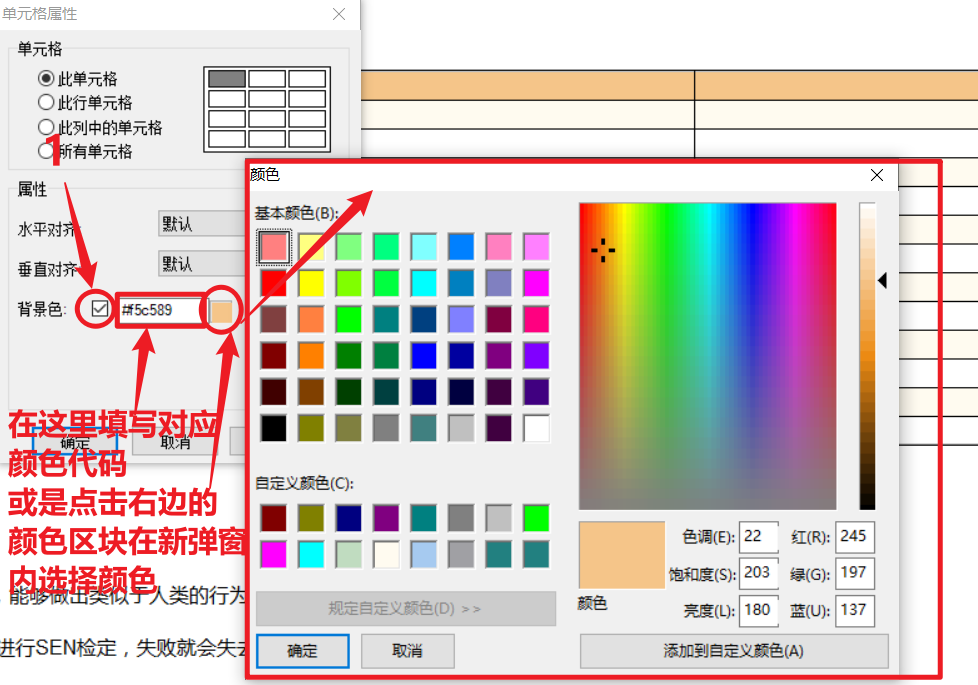

一般来讲表格用上的颜色如下：

以上两种颜色轮流穿插于表格中。

学会上面的步骤后，就可以编辑如下图所示一样美观的表格了！

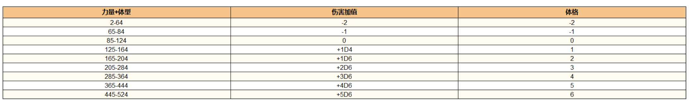

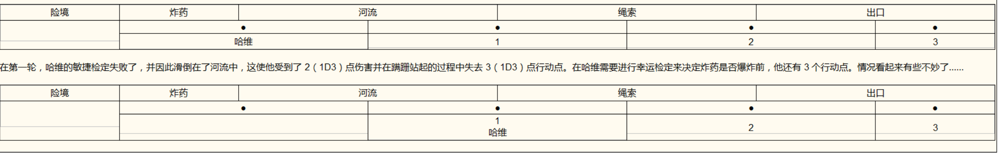

---

::: tip 进阶：编辑更复杂的表格

winchm 编辑表格的功能十分有限，单在 Winchm 上没法实现跨行、跨列单元格的功能，如果你想制作跟下图一样精美的表格的话，请查看**从源代码编辑不全书：表格**部分。

:::
