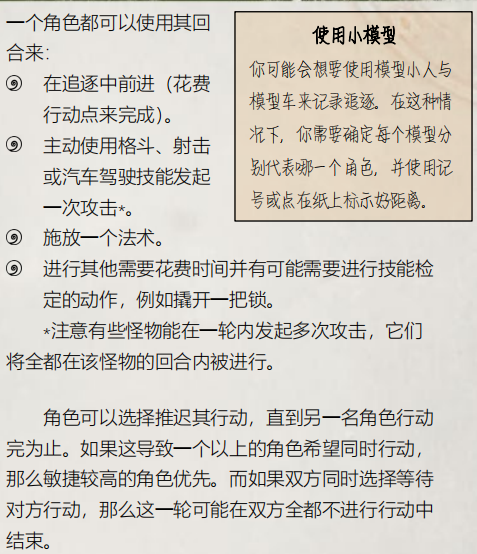
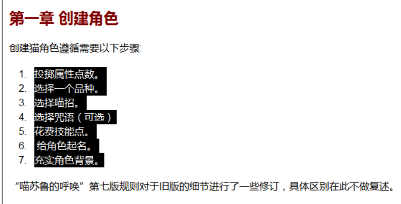
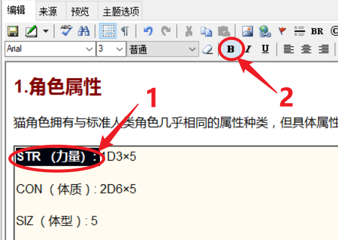
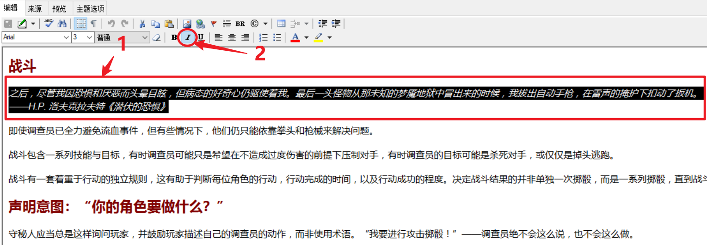
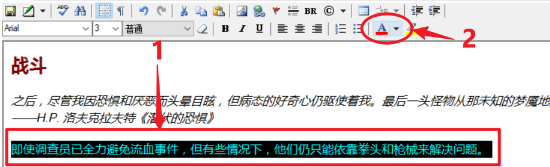
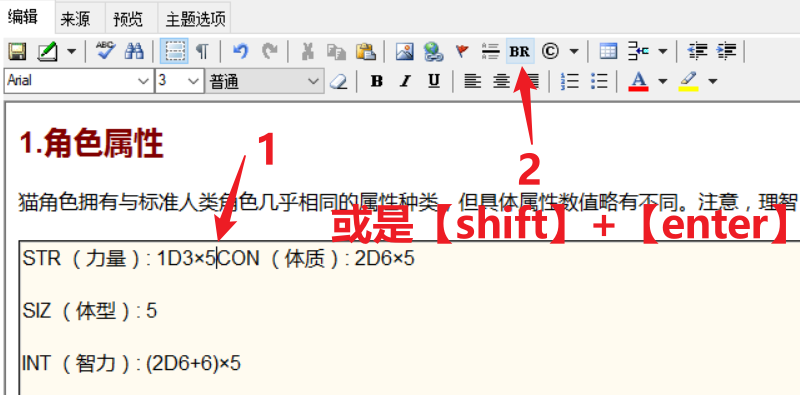
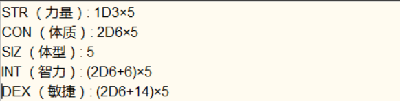

# 文字编辑

在新建项目那块，我们初步介绍了如何编辑文字，下面我们将会围绕文字这块进行更多的编辑。

## 一 更改文字项目

word 文档里，文字会有不同的样式，例如标题、正文。为了统一格式，我们会在之前的步骤清除 word 原有的文字格式，然后在 Winchm 用自带的样式更改文字样式。

首先，根据上个页面的步骤，初步建立一个页面。

然后选中你要改变样式的部分，点开红圈内的箭头，然后选中你想要的样式。

这样就可以改变选中文字的样式了。

## 二 如何创建列表

我们在看书时，有时会遇到这种前缀带有数字或者符号，然后并列排在一起的文字，这种文字，叫做列表。

我们但是洗净的文字不会附带列表属性，我们得自己手动让文字恢复成列表。

首先，选中你想设为列表，然后点击上方红圈中的图标。

这样文字就变成前缀是数字的列表了。

如想创建不带数字的列表，请点击右方的图标。

## 三 为文字添加别的元素

### 加粗

选中你想加粗的文字，然后点击上方的那个`B`按钮。

### 斜体

选中文字，然后点击上方的`I`。

### 下划线

选中文字，然后点击上方的`UL`。

### 字体颜色

选中文字，然后下图中红圈内的图标，点击图标右边的箭头即可设置字体颜色。

### 突出显示

选中文字，然后下图中红圈内的图标，点击图标右边的箭头即可设置字体后的颜色。

## 四 清除文字元素

上面我们介绍了如何给文件加上各种各样的属性，下面将会介绍如何清除文字里的属性。

选中文字，然后点击上方的橡皮擦图标按钮。

::: warning 注意！

这种办法对于从直接从 word、pdf等文档复制过来的文字是无效的，因为这些文档的文字里属性太多，winchm 不能有效识出，这也是为什么我们要求文字贴到 Winchm 前必须放在 txt 里贴贴一道的原因。

:::

## 五 手动折行

有时候我们不希望文字分得太开，希望文字更紧凑一些，这个时候我们就不会将这两段变成两个段落，而是用折行把这两段话分开。

首先，点击要这行的部分，折行前要确认这两个句子位于同一段落。

然后点击上方的`BR`，或是同时按回车键与`Shift`建。

这样就可以对两段文字进行折行了。

## 六 改变文字对齐方式

默认情况下，文字是向左对齐的，但是我们也可以更改文字对齐的方式。

首先选中文字，然后点击红圈内的图标，就可以改变文字的对齐方式了。

