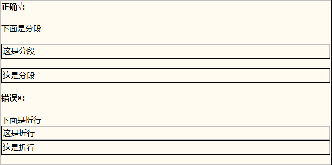
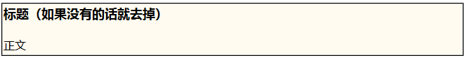
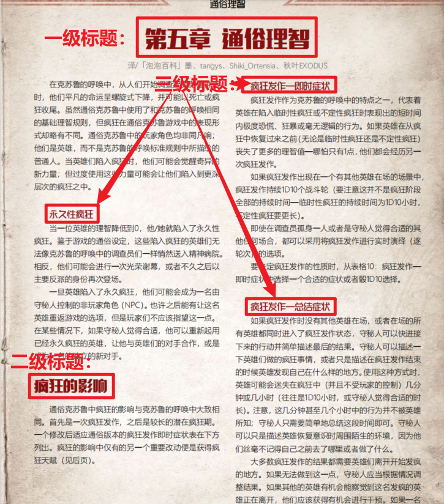
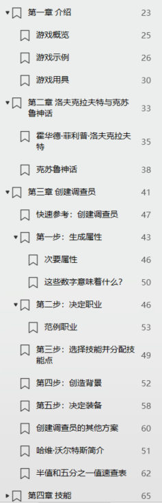
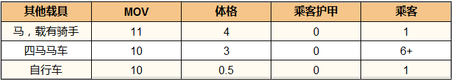
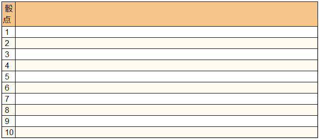
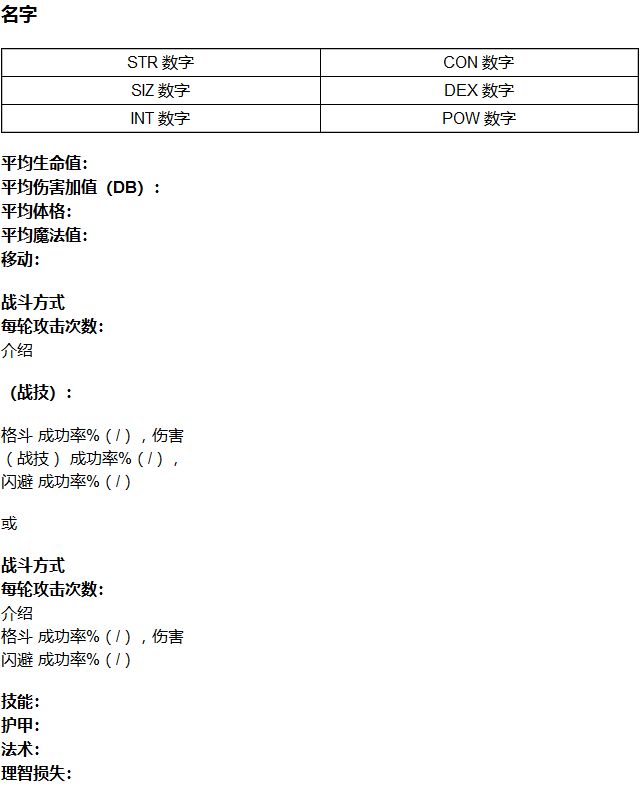

---
lang: zh-cn
title: 格式一致
---

# 格式一致

不全书所有的页面都要统一格式，这样才可以使不全书内部的元素统一，也方便后期编辑。

git 库里模版文件夹里提供了最基础的项目文件：`空白页模版.htm`，请确保你一切的编辑，都是以这个模版为基础进行的。

关于在 winchm 更改新建主体的模版，请查看[更改默认模版](A href="../Winchm/newfile.md" "更改默认模版")。

此外其他有规定的格式，模版文件夹里也提供了对应的模版。

## 文字相关

### 1.正文

不全书的正文字体默认为：`Arial,Helvetica,sans-serif`（中文：宋体，英文：Helvetica，无衬线）。跟此页面的正文一致。如果不一致，就说明你没有采用空白页模版。

此外不全书不采用出宋体外其他文字，原因是 chm 文件跟一般文档文件不一样，它文字显示这块关系到阅读者的电脑，如果用上了阅读者电脑里没有的字体，文字会出错。因此不全书里面所有的文字都采用宋体。

此外不全书里，不同段之间，绝大多数都用分为两个段落的形式进行换行，而不是折行。

::: info 对比

#### 两个段落

这是两个段落

中间有空行

#### 折行

这是折行  
中间没空行

:::

但一些时候，我们会采用折行，来让一些文字更加紧凑，如：

::: info 示例

**平均生命值：**  
**平均伤害加值（DB）：**  
**平均体格：**  
**平均魔法值：**  
**移动：**

:::

关于必须用折行的情况，我们都在编辑守则里说明或在模版文件里提供。其余情况编者自行判断。

另外要注意的是，其他元素（如照片、表格）之间换行也有折行与分段两个办法。除文字之外的元素必须单独作为一段，如果使用折行的话会导致他们紧紧的靠在一起。

### 2.引言

引言全部采用斜体字体，中间用折行来换行：

::: info 示例

*人类的思维无法将所有事物联系在一起，我想，这便是世上最大的仁慈了。我们生活在一片名为无知的平静小岛上，困于浩渺无垠的幽暗海洋，却并非要向彼方远航。科学的各个分支在各自的领域不断延伸，虽迄今为止并未伤害到我们，但终有一日，各个领域的知识将拼凑在一起，展现出骇人的现实图景，指明我们在其中的可怖位置。在这启示之中，我们只能陷入疯狂，或是逃离这致命的光明，进入黑暗纪元，祈求和平与安宁。  
——H.P.洛夫克拉夫特《克苏鲁的呼唤》*

:::

### 3.文本框

在书中会有各种各样的文本框样式，但不全书只使用一种：

### 4.标题

一般书中包含三种标题：

在不全书中页面中，首标题格式统一如下：

::: info 首标题

<STRONG>总之是个标题</STRONG>

:::

如这个页面内有其他标题，原文中是二级标题的用标题二，是三级标题的用标题三，三级标题下还有标题的话用标题四。

其他标题默认使用 html 里面的默认标题格式。

当然不一定要这么做，如果你想法有分歧的话，也可以到群里询问意见，我们并不是一成不变的那种人。

### 5.目录

不全书的目录在原书的目录上进行修改。为了预防超行，目录里建议省略掉“第 x 章”的前缀。

  

### 6.列表

列表统一采用&nbsp;html 提供的两种格式：

::: info 列表

#### 无序列表

- 列表项
- 列表项
- 列表项

#### 有序列表

1. 第一个列表项
2. 第二个列表项
3. 第三个列表项

:::

### 7.表格

在不全书中，表格默认宽度为100%。除了怪物属性表，表头橙色（注：一些表格没有表头），其余背景颜色按照肤色、白色循环。

当表格列与列之间的文本量相差不多是，列宽平分，表格文字居中，如下图所示：

此外当创建投点表时， 建议列宽占比布局要统一（投点列的列宽默认占比是3%,可根据实际情况进行修改）：

### 8.统一模版

以下的三大块模版是统一的，请牢牢遵守（如果文本有不同，在下面提供的格式基础下修改文本）。

如果对于某个部分感到困惑的话，可以在群里发言询问。
