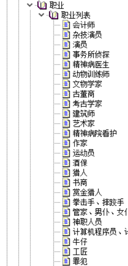
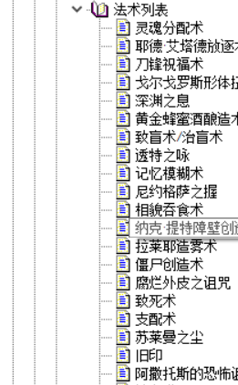
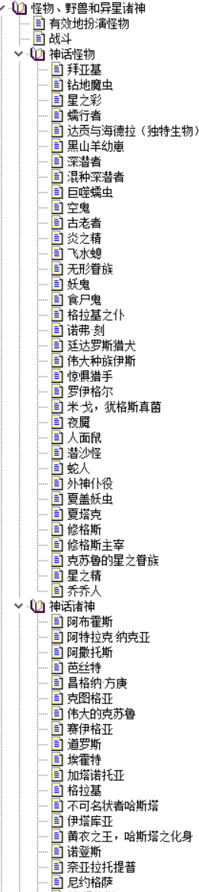

# 查阅为上

COC 不全书最主要的功能是帮助他人查阅，下面我们将介绍一些守则，这些守则可助最后编辑出来的成果阅读起来更加轻松。

## 空格

### 中英文之间需要增加空格

::: tip 示例

正确：

在 LeanCloud 上，数据储存是围绕 AVObject 进行的。

错误：

在 LeanCloud 上，数据储存是围绕 AVObject 进行的。

在 LeanCloud 上，数据储存是围绕 AVObject 进行的。

完整的正确用法：

在 LeanCloud 上，数据储存是围绕 AVObject 进行的。每个 AVObject 都包含了与 JSON 兼容的 key-value 对应的数据。数据是 schema-free 的，你不需要在每个 AVObject 上提前指定存在哪些键，只要直接设定对应的 key-value 即可。

例外：「豆瓣 FM」等产品名词，按照官方所定义的格式书写。

:::

### 中文与数字之间需要增加空格

::: tip 示例

正确：

今天出去买菜花了 5000 元。

错误：

今天出去买菜花了 5000 元。

今天出去买菜花了 5000 元。

:::

### 数字与单位之间需要增加空格

::: tip 示例

正确：

我家的光纤入屋宽频有 10 Gbps，SSD 一共有 20 TB。

错误：

我家的光纤入屋宽频有 10Gbps，SSD 一共有 20TB。

例外：度数／百分比与数字之间不需要增加空格：

正确：

角度为 90° 的角，就是直角。

新 MacBook Pro 有 15% 的 CPU 性能提升。

错误：

角度为 90 ° 的角，就是直角。

新 MacBook Pro 有 15 % 的 CPU 性能提升。

:::

### 全形标点与其他字符之间不加空格

::: tip 示例

正确：

刚刚买了一部 iPhone，好开心！

错误：

刚刚买了一部 iPhone ，好开心！

刚刚买了一部 iPhone， 好开心！

:::

## 合理分项

原文通常自带一个目录，但为了照顾阅读体验，不全书的目录划分时要对原来的目录进行一些优化。

例如说为了照顾一些不想被剧透人的体验，也是为了方便建立速查表，一些部分要单独划分成一个子项目。

当遇上以下情况时，要将那块页面进行拆分：

### 1.单块页面原文过长时

一个二级标题下原文过长时，建议再根据里面的小标题划分新的子页面。

### 2.可选规则

遇上可选规则时建议每个可选规则都单独建立子项目。

### 3.技能

遇到技能页面，单个技能要单独划分一个子项目。

### 4.职业

在职业这块，单个职业单独划分一个子项目。

### 5.法术

单个法术占单个页面。

### 5.神话书籍

单本神话书籍占单个子页面。

### 6.神奇物品

单个神奇物品占单个子页面。

### 7.NPC、敌人数据

单个 NPC 或敌人占单个子页面。

此外以上划分同样也作用在“组织”、“天赋”等元素集合。当我们遇到这种元素集合时，就要单个元素划分单个子页面。

## 批注

文章里出现批注，统一放在文章末尾。

标题、表格里的批注，放在标题、表格下方。

批注与正文要分为两段，批注与批注之间用折行分开。

## 链接

书中经常会出现类似这种：**XX 见多少页、转到 XX** 这种说明，如果要跳转的地方在别的项目里，则要给这个段文字加上对应的超链接。

此外如果遇到什么网站域名，也建议加上对应的超链接。

此外如果收录了目录页，建议给名字加上超链接，不用加上对应的页数。
