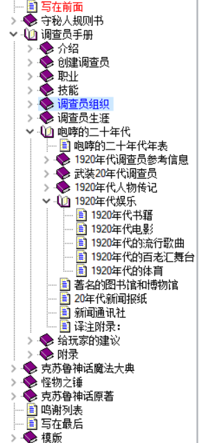
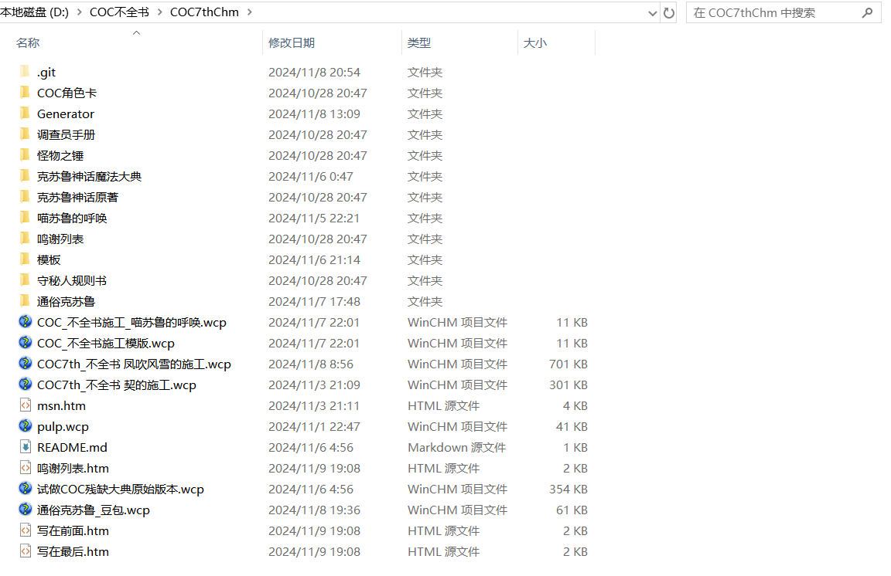
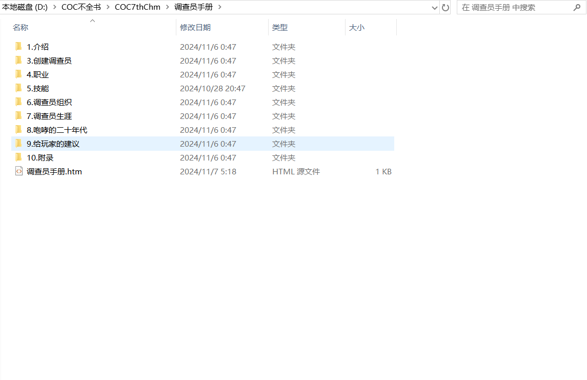
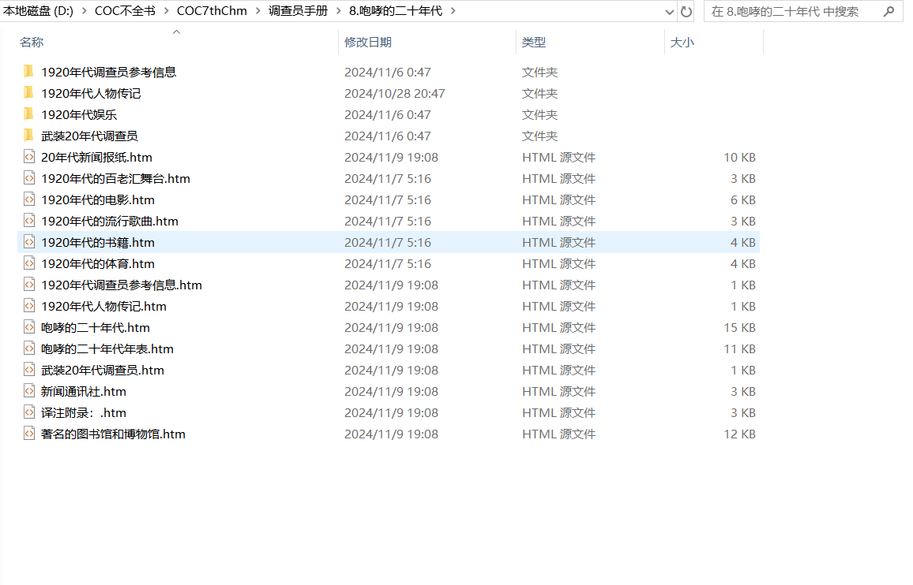
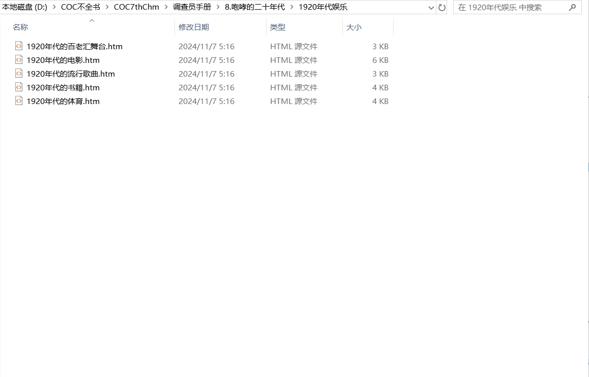

---
lang: zh-cn
title: 规范编辑
---

# 规范编辑

## 善用文件夹

每个项页面都对应一个 html 文件，最后一个扩展里，通常会包含上百个 html 文件，为了方便查找对应的文件，建议参照目录使用文件夹合理的收纳每一份文件,如下图所示：

*

注：可在文件夹与文件加上数字前缀以对文件夹进行排序，好方便查找。如果你是用插件生成&nbsp;wcp 的话，建议在扩展文件夹下第一层文件夹前面带数字前缀，更下级的文件夹不带。

## 多提多问

如果你有任何疑惑，或者任何改良的建议，都可以在群里提出来。我们十分欢迎！
