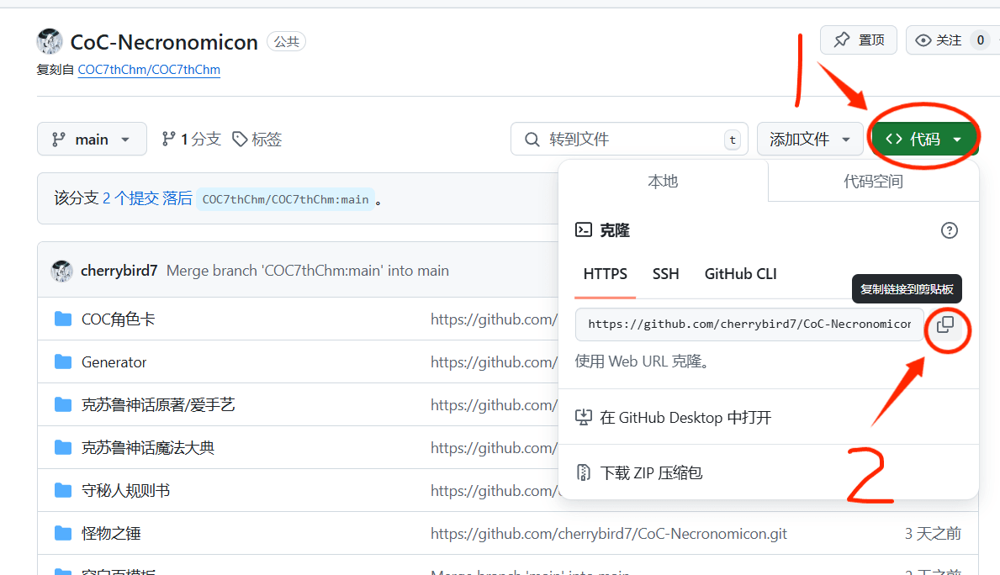
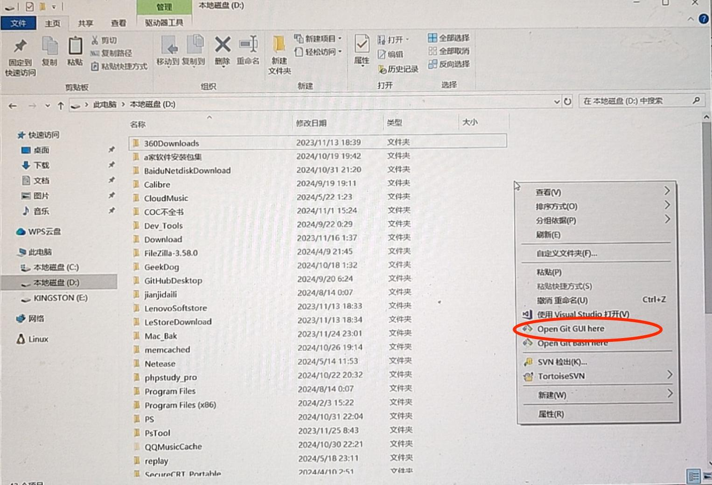
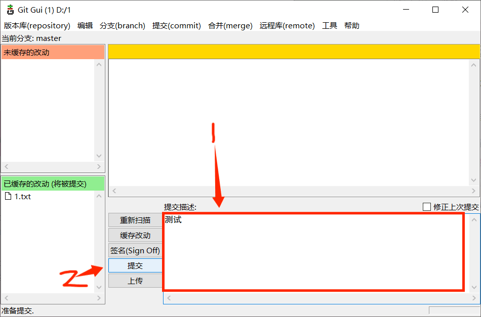
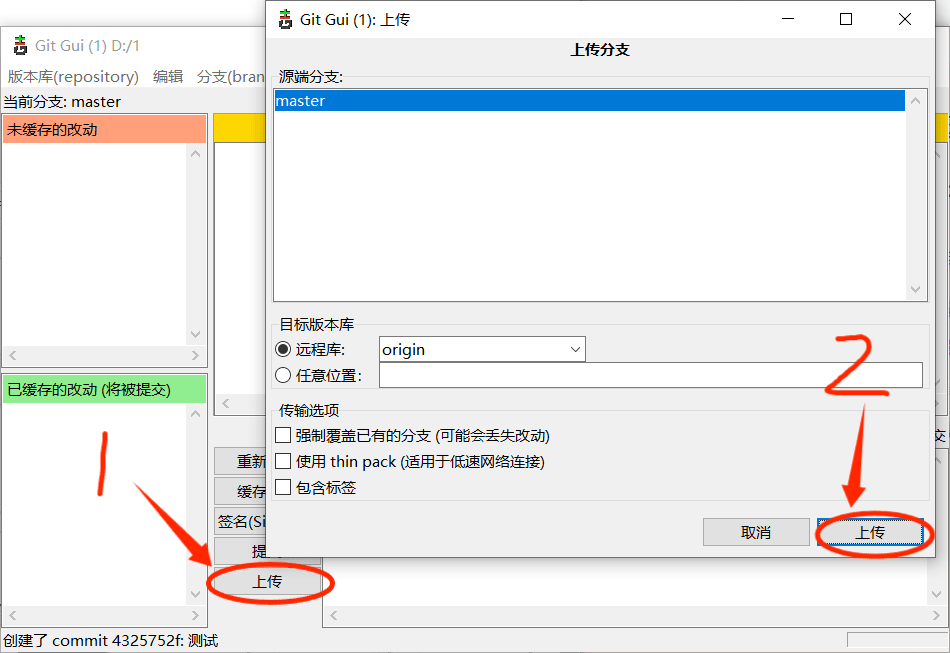
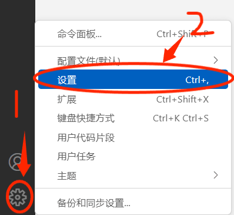
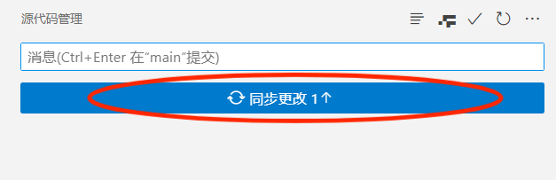

# 进阶：利用Git 上传编辑文件

如果你带有程序基础，不想安装 Github Desktop，想在编程程序里直接上传文件，推荐你安装 git 插件，这里介绍使用 Git Gui，以及在 VScode 用 Git 插件直接上传更改的方法。至于用 Gui Bash 的办法，请自行搜索。

## 一 下载 git

进入  Git 的官方网站，在网站里下载 Git。不全书编辑群里也有 Windows 系统上&nbsp;Git 的安装包。

官方网站界面：<A href="https://git-scm.com/" target=_blank >https://git-scm.com/</A>

## 二 汉化 Git Gui

Git Gui 里面全是英文，如果是英语苦手的话用起来会相对麻烦一些，因此提供汉化包地址：

<A href="https://Github.com/stayor/git-gui-zh" target=_blank >https://Github.com/stayor/git-gui-zh</A>

为了方便理解，接下来一切界面都已汉化。

##   . 复制 Github 库的网站地址

每个 Github 库都有单独的网站地址，这些地址在一些插件中可用于导向这个储藏库，从而实现各种作用。

1.首先，你要在不全书的 Github 库里复刻一份新的储藏库，具体参考前面的[如何能够编辑 Github 库](./githubhttp.md) 。

2.然后点击右上方的`代码（code）`，然后你可以看到 HTTPS 下有一串网址，这就是你的 Github 库的网站地址，点击右边的那个方块，就可以复制你的储存库地址了。

## 四 利用 Git Gui 克隆文件&nbsp;&nbsp;

1.然后在随便什么地方右键，在弹窗中点击`Open GIt GUI here`。 

2.然后在 Git Gui 弹窗内选择`克隆已有版本库`。

3.然后参考上方的**复制 Github 库的网站地址** ，将你的储藏库网址贴贴到`源位置`旁边，然后在`目标目录`旁边，先输入你要储藏的地方（如 D 盘：D:/），然后再输入一个新名字（要确保你要存的地方不存在这个文件），然后点击下方的克隆。

4.当出现这个界面时，就说明你克隆成功了。你接下来就可以在本地编辑仓库的内容了。跟本地电脑一致。

## 四 利用 Git Gui 上传更改

1.首先，你要用右键点击你要上传修改的文件夹，在弹窗中点击`Open GIt GUI here`。然后他会弹出下面的页面，右上方的框内会显示你修改了那些文件。如果显示没有改动的话先点击如何重新扫描，这样他就会刷新界面了。

2.然后选择缓存改动，正常的话未缓存的改动的框内的内容会消失，已缓存的改动里会显示你更改的文件目录。

3.然后在提交右边的白框里写上你改动了什么，然后点击`提交`。

4.提交后点击`上传`，然后在新弹出的弹窗内再次点击`上传`。

5.当新弹窗是这个结果时，就说明你修改成功了。

## 五 用 Git Gui 更新本地储藏库

本地的储藏库无法自动更新网络不全书主库的内容，这需要我们手动更新。

点击上方的`远程库`，然后选择`从...获取`，最后点击`origin`就好了。

## 六 在 Visual Code 里直接上传文件

如果你是用 Visual Code 来辅助编辑文件的话，下载 git 后，Visual Code 会侧栏会出现一个跟树枝一样的东西，这个代表 Visual Code&nbsp;成功装上了&nbsp;Git 插件，你可以在 Visual Code 内直接上传文件了。

但有时会出现他一直上传但没成功的情况，这是因为你的 Visual Code&nbsp;限制了 Git 上传文件的行为，这个时候要你改 Visual Code&nbsp;的设置。

1.首先，点击 Visual Code&nbsp;右下方的齿轮，然后点击`设置`。

2.然后在设置界面的搜索框里面搜索“Use Editor As Commit Input”，然后将下方红框内的勾选取消掉。

3.然后再次点击 Git 插件按钮，然后在白框里填写你修改的地方，点击`提交`。

4.当侧栏出现这种内容时，就说明你提交成功了，然后点击同步更改就可以正式把你的修改同步到网络上了。

::: tip

你没法利用以上的程序发送合并请求，关于如何将你的复制的储藏库合并到不全书库里，请参考[六.发送合并请求](./githubhttp.md)。

:::
